```{r setup, include=FALSE}
knitr::opts_chunk$set(echo = TRUE)
library(dplyr)
library(ggplot2)
library(ggridges)
library(janitor)
library(emo)
library(knitr)
library(kableExtra)
library(VisualStats)
library(rice)
library(rintcal)
library(flair)
library(c14bazAAR)
library(c14)
library(stratigraphr)
library(rcarbon)
library(oxcAAR)
library(tidyr)
library(purrr)
library(patchwork)

source("oxcalSimulate_cc.R")

colorize <- function(x, color) {
  if (knitr::is_latex_output()) {
    sprintf("\\textcolor{%s}{%s}", color, x)
  } else if (knitr::is_html_output()) {
    sprintf("<span style='color: %s;'>%s</span>", color,
      x)
  } else x
}
```

```{css, echo=FALSE}
<style>
p.caption {
  font-size: 0.5em;
}
</style>

```

# Introduction

This workshop is an introduction to the use of radiocarbon dating in archaeology. Using the example of an excavated cemetery to think about the analytical tools and logic involved, it will introduce means of analysis, both conceptual (how do we think about this problem) and practical (how do we interpret and work with the results of radiocarbon assays). We will cover eminently practical issues:

-   what should we date?
-   what information should we gather about what we date?
-   how many dates do we need?
-   what do we do with $^{14}C$ dates once we have them?

It's impossible, however, to address these practical issues without engaging with some broader theoretical issues in archaeology: what do we want to know about the human past, how and why is estimating the ages of objects with high precision important in that project, and how can and should we manage uncertainty in making claims about that past?

Let's begin with an example of the identification and collection of a sample that can be dated using radiocarbon.

```{r echo = F, fig.cap = "Sample identification and recovery."}
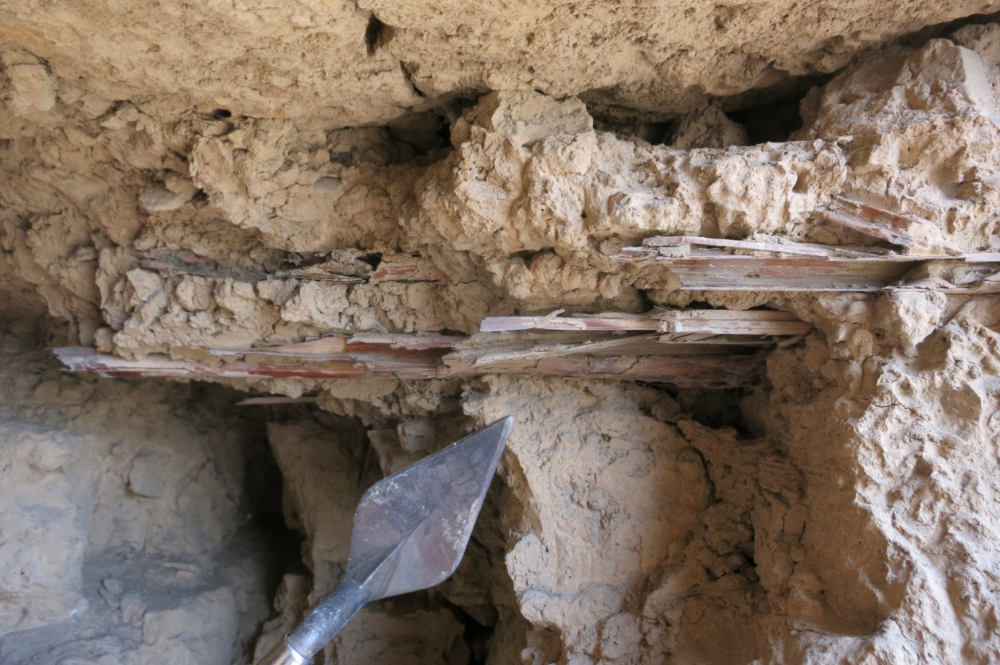
```

What are we measuring, if we submit a sample of this cane (*Gynerium sagittatum*) to a radiocarbon laboratory for analysis? Age. Age of what? The sample that we’ve collected from a context of interest (in this case, cane incorporated into adobe construction). More specifically, we’re measuring the age of the carbon in that cane, which is to say time at which it stopped incorporating (atmospheric) carbon. The age of this sample provides us with a *dated event*. What is the age we want to know? In this case, the date of construction – this is our *target event*. How *dated event* relates to *target event* is perhaps the most important question that we can ask, and applies as surely to radiocarbon dating of a human burial, a destruction layer, or a maize cob recovered from a midden as it does to a construction event.

In this workshop we will focus mostly on using [OxCal](https://c14.arch.ox.ac.uk/oxcal.html) to address practical aspects of working with archaeological radiocarbon results (How do I calibrate this date?; Which calibration curve should I use?; How can I get more precise age estimates? etc.). However, you will be a *much* more effective user of OxCal (or any other tool) if you understand the data that you are working with and are prepared to think hard about your radiocarbon-dated samples - so this workshop will equip you to do that too.

# Preparation

We will not focus on the physics underlying radiocarbon age measurements, nor on laboratory procedures, beyond some brief references as necessary. There is an abundance of literature on these aspects of radiocarbon in archaeology (*e.g.*, [@taylor2014; @wood2015]). Analysis of large assemblages of radiocarbon dates is also a topic unto itself, involving distinct questions, logics, and methods [see, for instance, @bronkramsey2017; @crema2021; @contreras2024]. Rather, we will focus here on applying radiocarbon dating in site-scale archaeology.

## Readings {#readings}

Useful background and vocabulary can be found in Bayliss and Marshall's [-@bayliss2022] handbook ([freely downloadable!](https://historicengland.org.uk/images-books/publications/radiocarbon-dating-chronological-modelling/)). I would suggest reading Ch.1 (p3-15) and reviewing the Glossary (p116-119) *before* this workshop. For Session 2, please read Ch. 2 (p16-22).

## Software

We will use [OxCal](https://c14.arch.ox.ac.uk/oxcal.html), which can be either run online or installed locally. There is no need to install it locally for this workshop, but you will need to register to get access to the online version ([here](https://c14.arch.ox.ac.uk/oxcal.html#program)). When prompted to log in, select 'New User' and enter your information; you should then receive an email with login information.

OxCal is far from the only tool for calibrating and modeling radiocarbon dates (see, *e.g.*, [ChronoModel](https://chronomodel.com/). OxCal has a few important advantages, however: it is clearly documented [e.g., @bronkramsey2001], widely used in archaeology, and has an active and supportive [community](https://groups.google.com/g/oxcal). For simple calibration there are even more options; see, *e.g.*, [CalPal](https://www.calpal-online.de/), as well as various *R* packages such as [BChron](https://andrewcparnell.github.io/Bchron/) and [rice](https://cran.r-project.org/web/packages/rice/vignettes/rice.html).

Useful packages for *R* users include:

-   **Bchron** [@parnell2015]
-   **rintcal** [@blaauw2025]
-   **rice** [@blaauw2024]
-   **rcarbon** [@bevan2017]
-   [**c14**](https://github.com/joeroe/c14)
-   [**stratigraphr**](https://stratigraphr.joeroe.io/articles/cql.html#overview)
-   **c14bazAAR** [@schmid2019]
-   **ArchaeoPhases** [@philippe2024]

## Exercises

The introduction to common questions, methods, and issues is built around examples using simulated data that you will calibrate and model using OxCal. These data are provided below with each exercise.

## Additional recommended readings

### Using radiocarbon dating in archaeology

-   impacts of Bayesian modeling on archaeological radiocarbon [@bayliss2007; @bayliss2009]
-   general radiocarbon information on [Maarten Blaauw's website](https://maarten14c.github.io/)
-   radiocarbon and archaeological theory [@bayliss2018; @griffiths2023]
-   reporting standards for publishing dates [@millard2014; @bayliss2022, Section 3.6]
-   the process of radiocarbon measurement [@bayliss2004; @wood2015]
-   sampling consideration [@blaauw2018; @holland-lulewicz2021]

### En español

Para quienes prefieren recursos en castellano, existen varias opciones. Unos capítulos en [*Métodos cronométricos en arqueología, prehistoria y paleontología*](https://dialnet.unirioja.es/servlet/libro?codigo=822086), editado por Barceló y Morell, introducen tanto los conceptos del uso del $^{14}C$ en la arqueología como los aspectos prácticos de OxCal. Desafortunadamente no parece ser disponible en forma digital, pero unos capítulos se pueden encontrar en los redes sociales académicos de los autores.

-   Lozano Medina, Águeda, and Capuzzo, Giacomo. 2020. Modelos cronométricos en OxCal. In *Métodos cronométricos en arqueología, prehistoria y paleontología*, edited by Joan A Barcelo, and Berta Morell, pp. 315–328. Dextra, Madrid.
-   Buck, Caitlin E, and Juárez, Miguel A. 2020 Modelización bayesiana de radiocarbono para principiantes. In *Métodos cronométricos en arqueología, prehistoria y paleontología*, edited by Joan A Barcelo, and Berta Morell, pp. 297–314. Dextra, Madrid.
<!-- -   [upload Contreras chapter from Barceló volume to github page and link here?] -->

### Radiocarbon dating in the archaeology of the Central Andes

-   History [@contreras2022]

-   Examples of applications of Bayesian modeling include [@quilter2025, SM; @osborn2023; @marsh2019]

-   Overview of existing radiocarbon evidence [@contreras2025, and papers in the special issue of *Quaternary International*; @capriles2023]

-   Previous overviews [@velarde1998; @ziolkowski1994]

# Radiocarbon dating in archaeology

Archaeology students learn surprisingly little about dating, which is treated - not unlike excavation methods and recording- as something that can be taken for granted, a technical problem rather than an interesting or theoretically significant one. In fact the kind of thinking that it requires - about priors and confidence; samples and distributions; depositional relationships; the measurement, understanding, and representation of time - makes us better archaeologists.

I am not going to give you a set of rules for dating - that is, sample selection and data analysis/interpretation. Rules are for the intellectually lazy - and the best rule is to think hard about what you want to know and how to find it out.

Some key vocabulary (see also Bayliss and Marshall's [-@bayliss2022] Glossary (p116-119)):

-   radiocarbon age
-   calibration
-   priors
-   sampling
-   distribution
-   uniform / normal / exponential / etc.
-   probability density function

# Radiocarbon in Central Andean archaeology

> $^{14}C$ dates from 14 Central Andean samples (of which 12 were archaeological, provided primarily by Junius Bird but also by George Kubler and Donald Collier) appeared in print as early as 1951, included amongst the first samples of unknown age dated by the radiocarbon method (Arnold and Libby 1951:119–120; Bird 1951). Even as these were first published (and re-published in Spanish shortly thereafter [Bird 1952]), Bird was already attempting to use the stratigraphic relationships between these dates to constrain the possible dates, and grappling with how to interpret the probabilistic nature of the data (*e.g.*, Bird 1951: Fig. 1 and p47). Construction of macro-scale chronologies (*e.g.*, Bird 1951:Table 2) for the region was the primary concern. (Contreras 2023:3)

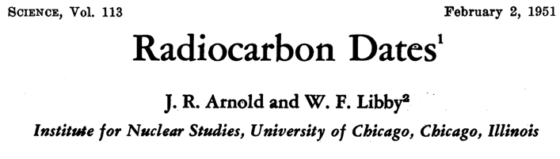 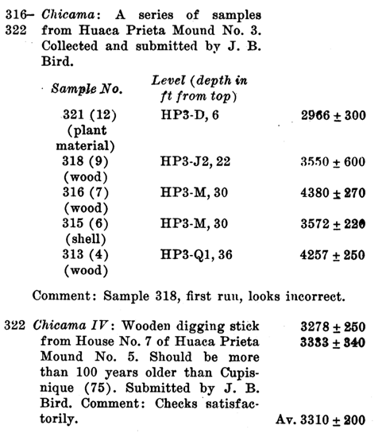

The point of these samples was not so much to establish age as to use samples of known antiquity to demonstrate that the radiocarbon method of age estimation worked!

> Renfrew (1973) and subsequently Taylor (1995) and Bayliss (2009) posit three distinct revolutionary impacts of radiocarbon dating on archaeology: the introduction of a reliable method of absolute dating, calibration that could relate those dates directly to calendar years, and methodological improvements (atomic mass spectroscopy [AMS]) that vastly increased the numbers of dates produced. (Contreras 2023:3)

-   Detectable in the Central Andes!


```{r echo = F, out.width='100%', out.extra='style="padding:10px"', fig.cap="Publication of $^{14}C$ dates for the Central Andes, 1951–2020. While post-1994 dates are certainly undercounted, the overall pattern remains a coherent one of adoption, incremental increase until a jump in the late 1970s, and then relative stability until a second increase in the early twenty-first century. (Contreras 2022)"}
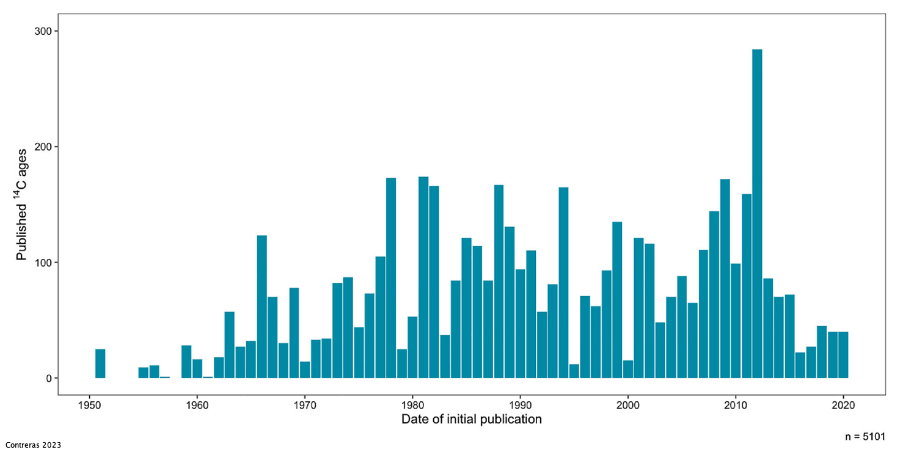
```


# A Worked Example: Dating a Cemetery {#cemetery}

A common challenge in archaeology is the excavated cemetery.

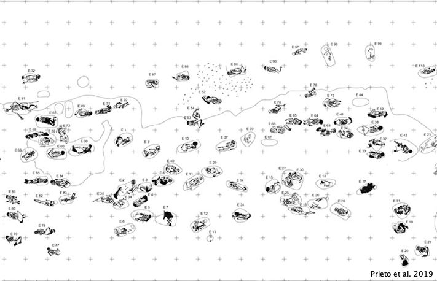

While in some ways cemeteries are unique - embodying uniquely simplified depositional processes, compared to domestic sites - in other ways they present some challenges common to many archaeological context. One of the most salient of those challenges is distribution in time. We might want to know (among other things):

-   When did use as a cemetery begin?
-   For how long was the area used as a cemetery?
-   When did use as a cemetery end?
-   Was there a period of more intense use, and if so when and for how long?

In the case of a cemetery the events are interments - but the same logic applies to construction, habitation, use of ceramics, etc.

## Working with simulated (radiocarbon) data

We'll work here mostly with simulated data, rather than real archaeological data. Why? So that we can evaluate our results against a *known* 'reality'. In Exercise 1 we will posit a given pattern of activity that produced a burial population (*e.g.*, regular burial over 200 years, or a slow start followed by a century of peak activity followed by a slow decline, etc.), generate some simulated radiocarbon data from that burial population (*i.e.*, sample that population randomly, then simulate radiocarbon dates from those samples), then calibrate the dates and examine our results to see how closely we can reproduce the original distribution. Then - Exercise 2 - we will introduce some complications that reflect the messy reality of our radiocarbon samples, which for a variety of reasons that we'll consider may not exactly reflect the dates that we want to know. Keep in mind throughout that there are two levels of stochastic effects here: both our selection of calendar dates and the radiocarbon dates that we simulate from those are random, and we would get slightly different results if we were to carry out the process again.

## *Distribution* of events in time

Basic inferences about a cemetery are fundamentally problems of sampling and distribution:

-   Uniform (*x* burials/year for *y* years)
-   Normal - Single event (sacrifice,plague, etc - unlikely but not unimaginable)
-   Exponential (frequency of use increasing over time)
-   Negative exponential (frequency of use decreasing over time)
-   *actual* distribution can be represented precisely by a pdf

```{r echo = F}
#plot distributions noted above, with plausible values (date range) for a Lambayeque cemetery

norm <- distribution_plot('norm', mean = 950, limits = c(600, 1300), sd = 100)

norm_lowsd <- distribution_plot('norm', mean = 950, limits = c(600, 1300), sd = 1)

unif <- distribution_plot('unif', min = 800, max = 1100, limits = c(600, 1300))

exp <- distribution_plot('exp', limits = c(800, 1100), rate = .01)

(norm + norm_lowsd) / (unif + exp)
```

## Archaeological approaches to a cemetery population

We might have something like this: 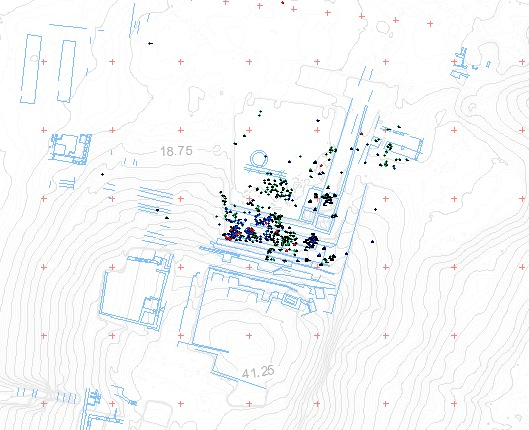

...and we might want to know (among other things):

-   When did use as a cemetery begin?
-   For how long was the area used as a cemetery?
-   When did use as a cemetery end?
-   Was there a period of more intense use, and if so when and for how long?

These are fundamentally problems of *age estimation* and *sampling*.

Likelihood of the age of a given sample is governed by the temporal distribution of the population of events dated.

With *enough* sample ages, can reconstruct distribution. *How many* is *enough* depends on the distribution and on how confident we want to be.

So...how do we estimate the ages of burials? What precision do we need?

### Estimating the age of burials

Radiocarbon is of course not the only tool available for estimating the age of burials. More commonly - because cheaper and easier - we might use diagnostic material culture.

Non-$^{14}C$ tools: typology, *TPQ* and *TAQ*, dendro (this isn’t an intro-to-arch class, so mostly we don’t need to catalog these…except to note that they’re probably going to be unsatisfying in terms of precision and reliability, and that they may be interesting sources of *priors*)

### Sampling and precision

Our age estimates need to achieve some level of precision in order to be useful. That level depends on questions of interest. If all we care about is that cemetery use occurred between *x* and *y*, and we’re not worried about whether use actually *fillled* that span, then little precision and few samples are required. That is, if we can estimate the ages of a handful of burials, using whatever method, we can say with reasonable confidence that the cemetery was in use between *a* and *b*.

For example, let's suppose that our cemetery was in use between 800 - 1100 CE, and that every year within that span, 5 individuals were interred. This would give us a burial population of 1500 individuals, uniformly distributed throughout that span. Let's further suppose that each of these individuals conveniently has their date of death - in some format that we can decipher - inscribed on a sherd buried with them. Using that, we catalog the ages of five burials.

```{r echo = F, warning = F, message = F}
set.seed(42)
bur5 <- data.frame(ages = round(runif(5, min = 800, max = 1100), 0)) 

bur5 %>% kbl() %>% 
    kable_minimal(latex_options = "basic", full_width = F)

```

Can we now answer our questions about the cemetery? i.e., when it was first used, and when it fell out of use? In fact, even with the ability to very precisely date burials, our best estimate of the span of use of the cemetery is 886 - 1081 CE - we are limited by our small sample.

What if we take a sample four times bigger, of 20 individuals? A list that long starts to get difficult to work with, so we'll plot them instead, including our original 5 in red.

```{r echo = F, warning = F, message = F, fig.show = "hold"}
set.seed(42)
bur20 <- data.frame(ages = round(runif(20, min = 800, max = 1100), 0)) 

bur20 %>% kbl() %>% 
    kable_minimal(latex_options = "basic", full_width = F, position = "float_right", font_size = 7)

ggplot() +
  lims(x = c(800, 1100)) +
  scale_y_continuous(breaks = seq(0, 2, 1), limits = c(0,2)) +
  labs(y = "", x = "Age CE") +
  geom_histogram(data = bur20, aes(ages), binwidth = 1, col = "black", fill = "grey") +
  geom_histogram(data = bur5, aes(ages), binwidth = 1, col = "red") +
  theme_minimal() 

## then degrade precision, then simulate radiocarbon dates of same ages
```

Our estimate now would be that use of the cemetery began in `r min(bur20$ages)` CE and lasted until `r max(bur20$ages)` CE. We're having trouble capturing the actual beginning and ending just because the odds are only 5:1500 that we'll get a burial from any given year.

Of course, it's wildly unlikely that we'll be able to estimate the age of each burial with annual precision. Does it matter? What if we take those same 20 individuals, and instead make the (still optimistic) assumption that we have a reliable high-precision ceramic sequence, which we can use to estimate the age of any burial within phases of 40 years.

```{r echo = F, warning = F, message = F, fig.show = "hold", fig.cap = "Sampling from burials uniformly distributed between 800 - 1100 CE. Burial years in black/red; estimated to nearest 40 years in grey."}
set.seed(42)
bur20_low <- data.frame(ages = round(((runif(20, min = 800, max = 1100) + 19)/ 40)) * 40) 

bur20_low %>% kbl() %>% 
    kable_minimal(latex_options = "basic", full_width = F, position = "float_right", font_size = 7)


ggplot() +
  lims(x = c(800, 1100)) +
  labs(y = "", x = "Age CE") +
  geom_histogram(data = bur20, aes(ages), binwidth = 40, col = "black", fill = "grey") +
  geom_histogram(data = bur20, aes(ages), binwidth = 1, col = "black", fill = "black") +
  geom_histogram(data = bur5, aes(ages), binwidth = 1, col = "red") +
  theme_minimal() 
```

Now we might suggest that cemetery use began around `r min(bur20_low$ages)` and ended by about `r max(bur20_low$ages)`. We might even think about suggesting - wrongly, it turns out - that use increased over time. And what might our interpretation be if we had only those original five individuals to work with?

Of course, 40 years would be remarkably high precision for ceramic phases, and if we had that, we might not be too interested in radiocarbon. What happens if we think more realistically (for many archaeological scenarios) about ceramics that can be identified to within 100 or 200 years?

```{r echo = F, warning = F, message = F, fig.show = "hold", fig.cap = "Sampling from burials uniformly distributed between 800 - 1100 CE. Burial years in black/red; estimated to nearest 200 years in grey."}
set.seed(42)
bur200_low <- data.frame(ages = round(((runif(20, min = 800, max = 1100) + 90)/ 200)) * 200) 

bur200_low %>% kbl() %>% 
    kable_minimal(latex_options = "basic", full_width = F, position = "float_right", font_size = 7)


ggplot() +
  lims(x = c(650, 1150)) +
  labs(y = "", x = "Age CE") +
  geom_histogram(data = bur20, aes(ages), binwidth = 200, col = "black", fill = "grey") +
  geom_histogram(data = bur20, aes(ages), binwidth = 1, col = "black", fill = "black") +
  geom_histogram(data = bur5, aes(ages), binwidth = 1, col = "red") +
  theme_minimal() 
```

Here we would likely produce some interestingly wrong interpretations. The low precision with which we can date burials would suggest to us that cemetery use began as early as 700 CE, while that low precision combines with sampling effects to lead us to suggest an increase in use over time, ending at 1100 CE (a date which we might *also* have gotten wrong, had our ceramic chronology not happened to have a phase that ended then).

We could carry on, varying sample size and precision, and exploring how well we felt able to describe cemetery use. Since our goal here is to be thinking about radiocarbon, we won't pursue that, but let's take a quick look at what happens if we consider a different model of cemetery use. What if, rather than 5 individuals/year for 300 years, cemetery use started slowly, peaked in 950, and then slowly declined?

```{r echo = F, warning = F, message = F, fig.cap = "Sampling from burials normally distributed between 800 - 1100 CE. Burial years in black; estimated to nearest 40 years in grey."}
set.seed(42)
bur20_norm <- data.frame(ages = round(rnorm(20, mean = 950, sd = 50), 0)) 

bur20_norm_low <- data.frame(ages = round(((rnorm(20, mean = 950, sd = 50) + 19)/ 40)) * 40) 

bur20_norm %>% kbl() %>% 
    kable_minimal(latex_options = "basic", full_width = F, position = "float_right", font_size = 7)


ggplot() +
  lims(x = c(800, 1100)) +
  labs(y = "", x = "Age CE") +
  geom_histogram(data = bur20_norm, aes(ages), binwidth = 40, col = "black", fill = "grey") +
  geom_histogram(data = bur20_norm, aes(ages), binwidth = 1, col = "black", fill = "black") +
  theme_minimal() 
```

Here we might suggest that cemetery use began around `r min(bur20_norm_low$ages)` and ended by about `r max(bur20_norm_low$ages)`. We can also detect a pattern of increased use ca. 950 - 1000 CE.

We might achieve something similar, if the span identified in regional chronological schemes with Lambayeque material culture were 800 - 1100 CE, simply by sampling a *single burial* and identifying some diagnostic piece of material culture. But what if ceramic/cultural chronology is insufficiently precise…or inaccurate? What if the span identified in regional chronological schemes with Lambayeque material culture were 700 - 1200 CE, rather than 800 - 1100 CE...or 950 - 1200 CE? We would be badly wrong, and in a way that mattered for our interpretation of both the site and for regional patterns.

Keep in mind as we address radiocarbon dating that we are focusing on the accuracy and precision with which we can estimate ages. As we've just seen, though, all the accuracy and precision in the world won't (and can't) address the uncertainties created by small samples.

Keep in mind also that these dated events - burials, in the case of our cemetery - could as easily be house abandonments, or offerings, or discard of recognizable (diagnostic) ceramics.

## Approaching a cemetery population using radiocarbon

Radiocarbon promises to solve some of these problems for us; under ideal circumstances we might be able to produce age estimates for date-of-interment accurate within 20-30 years for each individual. Suppose that we do settle on radiocarbon as a useful method that might offer us a solution to the imprecision of our ceramic chronology: What *can* we date, what *should* we date, and what *can we do* with the results? 
If we produce 20 radiocarbon age estimates on 20 interments with which to approach our questions about cemetery use - what does *their* distribution look like? To assess that distribution, we need to understand those radiocarbon age estimates. We'll take a quick look here at how we get from measured carbon isotope ratio to radiocarbon age to calendar age, and then focus on what you, as a practicing archaeologist, might receive from a lab to which you've submitted samples. We'll begin simply, and then introduce several issues that might complicate our interpretation of radiocarbon ages.

### What can/should we date?

Let's consider a single interment, examining the potentially dateable material available.

```{r burial1192, echo = F, out.width='100%', out.extra='style="padding:10px"', fig.cap="Entierro 11/92, Huaca Cao Viejo (Complejo Arqueológico El Brujo archives)."}
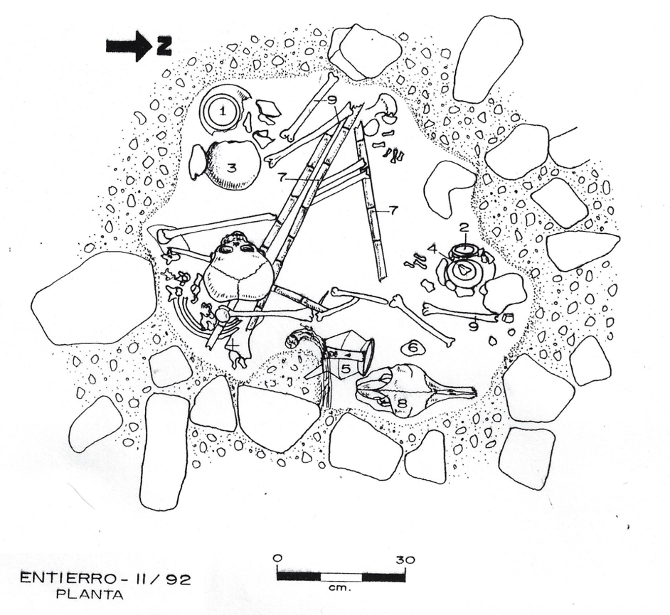
```

There are two guiding questions here.

<details>

<summary><b>1. What is the event whose age we wish to know (the *target event*)?</b></summary>

The answer (usually) is the depositional event - the moment of burial. Clarity about this is important because we might also for various reasons be interested in the moment of death, a moment of manufacture of some included material culture, a moment of disturbance of the burial, etc. With respect to our overarching questions about the cemetery, however, it's most likely that what we want is the date of interment, which then is our *target event*.

</details>

<details>

<summary><b>2. For which materials from this context might we be able to estimate an age using radiocarbon?</b></summary>

We are fortunate in that there are multiple dateable materials in this context (a luxury!).

-   ceramics may contain organic material (remnants of temper) and/or absorbed organic residues (1/5)
-   gourd (*Lagenaria siceraria*) (3)
-   textile fragment (6)
-   wood (algarrobo, *Prosopis pallida*) (2)
-   marine shell (4)
-   human bone (9)
-   camelid bone (8)
-   caña brava (*Gynerium sagittatum*) (7)
-   charcoal is not visible in the sketch, but because it's such a commonly dated material let's assume that some unidentified wood charcoal is present

</details>

Identifying these materials as potentially dateable, and clearly understanding what results they're likely to produce, takes us back to the fundamentals of $^{14}C$ as a dating method. Bayliss and Marshall [-@bayliss2022, Section 3.2] cover the logic and pitfalls of sample selection in greater detail than we can here.

```{r velarde-fig, echo = F, out.width='100%', out.extra='style="padding:10px"', fig.cap="The carbon cycle."}
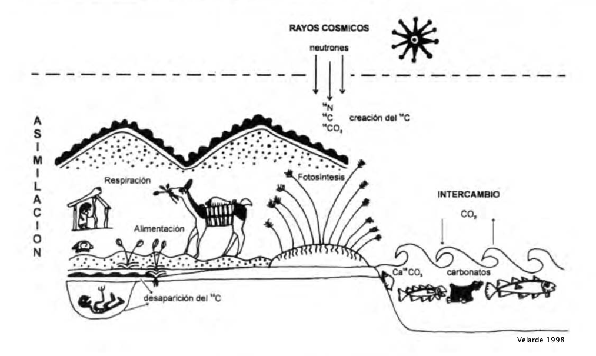
```

The key points - you can review the method in detail elsewhere; see [above](#readings) - are:

-   atmospheric $^{14}C$ - an unstable isotope of carbon that will radioactively decay - is produced by cosmic ray bombardment
-   $^{14}C$ - like other isotopes of $C$, $^{12}C$ and $^{13}C$ - oxidizes to form $CO_{2}$
-   that $CO_{2}$ disperses through the atmosphere, and then enters terrestrial and marine food chains when photosynthesized by plants
-   the carbon that plants and animals use to build tissue is derived from consumption of those plants - or of animals that consume those plants

Because this process is relatively rapid and because the atmosphere mixes, the ratio of carbon isotopes (*e.g.*, $^{14}C:^{13}C$) in plant and animal tissue is in equilibrium with the ratio in the atmosphere at any given time. That is, in the illustration above, the proportion of the carbon that is $^{14}C$ is the same in the atmosphere, the grass that photosynthesizes atmospheric $CO_{2}$, the camelid that eats the grass, and the human hunter that eats the camelid.

When an organism dies, it ceases to incorporate carbon into its tissue, and the $^{14}C$ incorporated into tissue while it was alive begins to radioactively decay. As a result, the proportion of $^{14}C$ in that organism begins to decrease. Because that rate of decay is known, is unaffected by environmental factors, and has not changed over time - the half-life of $^{14}C$ is 5730±40 years - the ratio of remaining $^{14}C$ to $^{13}C$ can be measured and used to estimate the amount of time that has passed since the organism stopped incorporating carbon. It's that measurement that a radiocarbon lab reports to the consumer, adjusted by convention to a BP timescale ('before present', where 'present' is fixed at 1950 CE).

### What happens when we submit one of those samples to a radiocarbon laboratory?

Laboratory procedures are intended to achieve two goals: 1) to make sure that the sample being measured consists exclusively of the material whose age is of interest, and 2) to accurately and precisely measure the radiocarbon age of the sample. What happens after that - how that radiocarbon age relates to the *target event*, and what that means for your questions - is your problem.

```{r echo = F, out.width='100%', out.extra='style="padding:10px"', fig.cap="Sample processing in AMS radiocarbon analysis."}
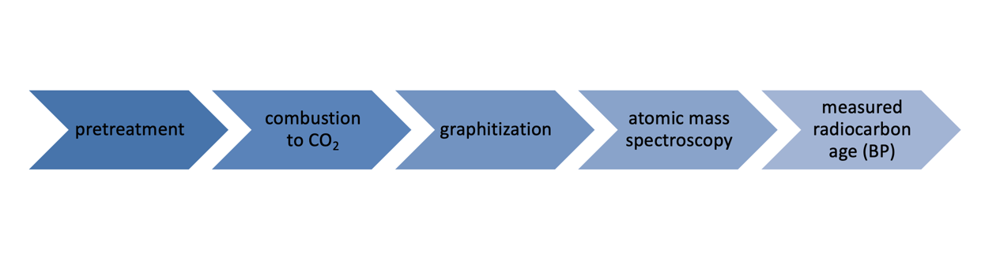
```

Pretreatment [see @wood2015, 63-65] is the process in which chemical and physical means are used to remove potential contaminants from the sample. Contaminants, even small amounts of which can significantly affect age estimates (see Blaauw's 'Contaminate-a-date' app, found on his webpage [<https://maarten14c.github.io/>] under 'Software and animations' / 'impact of contamination on C-14 ages') - are materials other than the sample, which might introduce carbon of different age. This can range from manual removal of macroscopic rootlets from charcoal to microscopic inspection to acid and base washes. Following pretreatment samples are combusted, converted into graphite and pressed into pellets that be analyzed in the atomic mass spectrometer, in which the carbon isotopes are separated by weight and counted. The measured ratio that results forms the basis of the calculated radiocarbon age that the lab reports. That radiocarbon age will look something like this example: **LabID-XXX \| 1100 ±40**.

The three components here are not the only things that matter, but they are the fundamental ingredients without which the date is not useful: the unique laboratory identifier, the radiocarbon age, and the estimated error (reported by convention as 1$\sigma$). That error represents the uncertainty with which the lab calculates the radiocarbon age, which is to say that the actual value is most likely to be 1100, is very probably close to that value, but might be as low as 1020 or as high as 1180, if we account for \~95% of the probability distribution).

That measured age looks like this, if we plot it as a probability curve.

```{r echo = F, fig.cap = "2-sigma distribution of 1100 ±40."}
distribution_plot('norm', mean = 1100, limits = c(900, 1300), sd = 40, cv = c(1020, 1180))
```

This is quite a manageable amount of uncertainty, and it's not hard to imagine that if we had 20 values like this, we could plot them on a timeline, producing something not unlike the plots that we were looking at above (where the uncertainty around each age is uniformly distributed, which is to say that if we know that an age falls in the 1020 - 1060 CE bin, it's equally likely to be any of the ages in that bin). *However*, because atmospheric production of $^{14}C$ has fluctuated over time - varying depending on cosmic radiation, sometimes in [dramatic ways](https://en.wikipedia.org/wiki/Miyake_event) that have some neat implications for archaeological dating [@price2023; @dee2016] - the same calculated radiocarbon age might have been produced by a sample originating in multiple different calendar years. Thanks to the efforts of the international community of radiocarbon researchers, this problem can be managed, because we can describe fairly precisely exactly how atmospheric radiocarbon has varied over the last 14000 years. These descriptions - slightly different for the northern and southern hemisphere because atmospheric mixing is in fact neither complete nor instantaneous (see [@hua2022]) - are the *calibration curves* that are periodically updated by the community: the current versions are IntCal20 [@reimer2020] and SHCal20 [@hogg2020]. These curves are measures - compiled by radiocarbon-dating many known-age tree ring samples at multiple labs - of changing atmospheric radiocarbon over time (to explore the underpinnings of IntCal20, see Maarten Blaauw's [Shiny app](https://radiocarbon.shinyapps.io/calibrationcurve/)).

When we *calibrate* a radiocarbon date, we are asking, "In what calendar year(s) might the amount of 14C that we've measured been produced?" The answer depends on the calibration curve. The result is an irregular curve (a *probability density function* [pdf]) that describes the range of calendar dates that might have produced our conventional radiocarbon age. Because the calibration curve is not smooth, this probability is not evenly distributed (unlike, for example, the symmetrical uncertainty described by the '±' in the conventional radiocarbon age). This pdf is usually summarized by referencing the 95% *high-density region* (HDR), which describes the highest parts of pdf, summing them until 95% (or whatever desired range) of the area under the curve is captured. Because of the irregularity of the pdf, these may not be contiguous.

```{r echo = F, fig.cap = "Calibrated age of LabID-XXX (1100 ±40). Calibrated using the R package **rice** (Blaauw 2024)."}
rice::calibrate(1100, 40, BCAD = T)
```

On the y-axis we can see our conventional radiocarbon age, plotted as the normal distribution described by that value and the associated error that the lab reports (reflecting measurement uncertainty). In green is the calibration curve - in this case IntCal20 - and on the x-axis is the *probability density function* that describes the span of time during which our sample might have been produced (over which, notably, it's more likely to have been produced in some years than in others). The HDR is shaded, and described in the upper right corner (most of the likelihood - 93.1% of the upper 95% - falls in the span 878 - 1024 CE, but there's a 1.4% chance that our sample was produced between 776 and 783 CE).

Maarten Blaauw has produced this animated visualization to illustrate how we get from the conventional radiocarbon age to calibrated pdf:

<video width="640" height="480" controls>

<source src="imgs/calibrate_fast.webm" type="video/webm">

</video>

When you calibrate a date in OxCal you'll get something similar, or you can produce plots exactly like this in *R* using the **rice** package, or using Maarten Blaauw's [Shiny app for calibration](https://radiocarbon.shinyapps.io/calibrate/).

### Calibrating a date in OxCal

To calibrate a single date in OxCal, launch the browser-based program [<https://c14.arch.ox.ac.uk/oxcal/OxCal.html>], and log in when prompted. Click either of the 'Calibrate' buttons, and fill in the name of the sample (usually the lab ID, though you may sometimes find it convenient to use other names), the conventional radiocarbon age, and the measurement error (see below).

```{r echo = F, out.width='60%', out.extra='style="float:left; padding:10px"', fig.cap="Calibrating a single date in OxCal."}
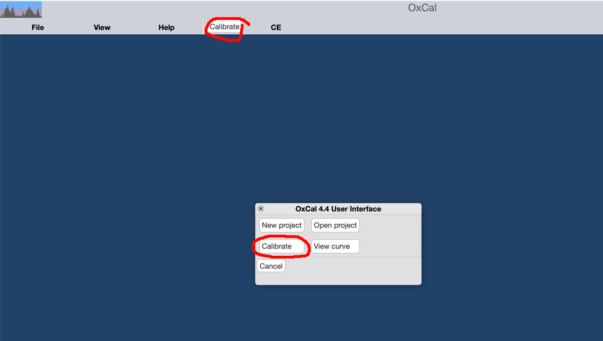
```

This will produce a plot similar to the one above, which illustrates the radiocarbon determination on the y-axis, the calibration curve, and, on the x-axis, the calibrated date that results from the intersection of those two. The HDR is also marked (by the brackets under the pdf) and enumerated at the upper right. The styling of this plot can be adjusted using the 'Edit'--\>'Format' drop-down menu.

```{r echo = F, out.width = c('60%', '40%'), out.extra='style="padding:10px"', fig.cap="Calibrated result from OxCal.", fig.show = "hold"}
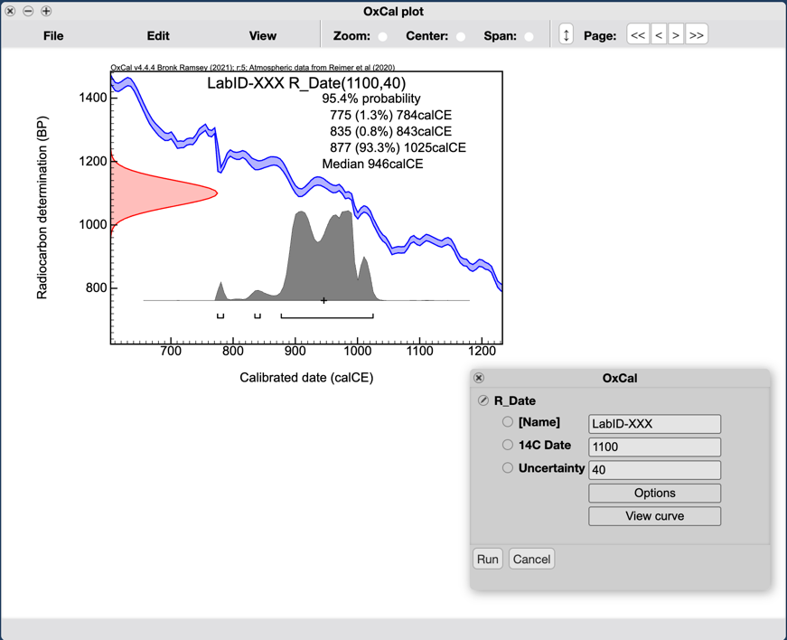

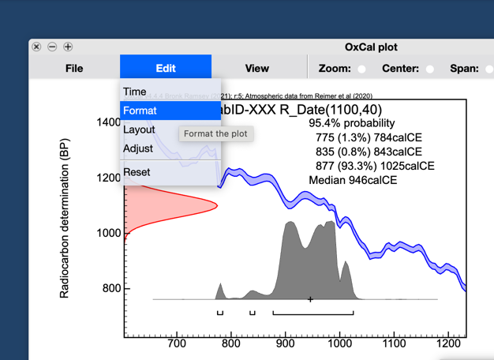
```

### Calibration curves {#curves}

As noted above, calibration is necessary because atmospheric radiocarbon has varied over time. It also varies in space (Figure \@ref(fig:hua-map)), driven at global scales by the contrast in relative land area in the northern and southern hemispheres and the relative segregation of the air masses in those hemispheres [see @marsh2018, 926-927 for an overview]. Two distinct calibration curves are the result: IntCal for the northern hemisphere and SHCal for the southern; current versions, published in 2020, are IntCal20 [@reimer2020] and SHCal20 [@hogg2020]. These are only modestly different (Figure \@ref(fig:ccurves)), but that slight difference can affect where the radiocarbon determination intersects the calibration curve (see Figure \@ref(fig:compare-calibs), where the bulk of the probability shifts only slightly, but the tail moves from pre-900 CE to post-1050 CE).

```{r hua-map, echo = F, out.width='100%', out.extra='style="padding:10px"', fig.cap="Hua and colleagues (2022) illustrate 20th-21st century  variability in atmospheric radiocarbon, based on atmospheric CO2 sampling (triangles) and Δ14C tree-ring records (circles)."}
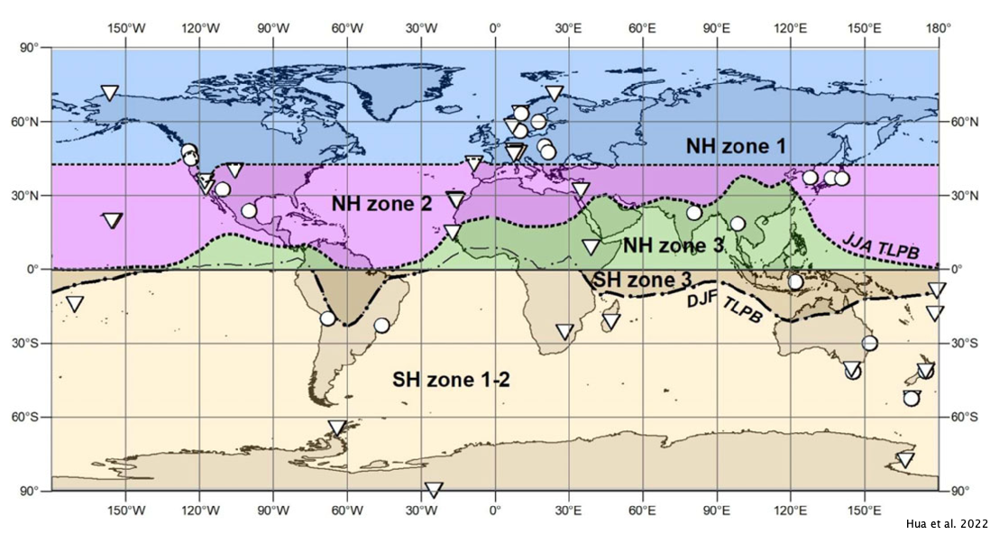
```

```{r ccurves, echo = F, fig.cap = "IntCal20 and SHCal20 from 1000 BCE to 1000 CE. Plotted using the R package **rice** (Blaauw 2024)."}
draw.ccurve(-1000, 1000, BCAD=TRUE, cc2='shcal20', add.yaxis=TRUE)
```

```{r compare-calibs, echo = F, out.width='50%', fig.cap = "Calibrated age of LabID-XXX (1100 ±40). Calibrated using the R package **rice** (Blaauw 2024).", fig.show = "hold"}
rice::calibrate(1100, 40, BCAD = T)
rice::calibrate(1100, 40, BCAD = T, cc = 3)
```

#### Specifying a calibration curve in OxCal

You can select calibration curves in OxCal by clicking on 'Options' and then 'Calibration' (Figure \@ref(fig:cc-select)).

```{r cc-select, echo = F, out.width='60%', out.extra='style="float:right; padding:10px"', fig.cap="Calibration curve selection in OxCal."}
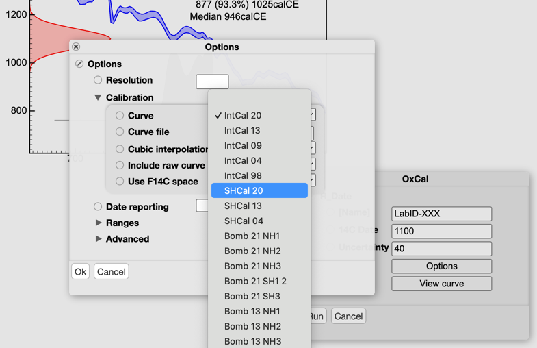
```

To juxtapose two versions of the same date calibrated with different curves in OxCal, we need a more complicated interface than what we use to calibrate a singe date, because we need to enter more information than just a radiocarbon determination and associated error. To open such an interface, select 'File'--\>'New'.

```{r echo = F, out.width='60%', out.extra='style="float:left; padding:10px"', fig.cap="Opening a new project in OxCal."}
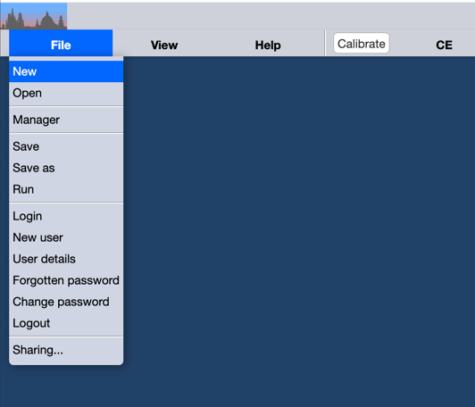
```

By default the 'Input' window that opens shows the 'Model' view. You can (and should) change this using the buttons at the lower left (Figure \@ref(fig:oxcal-toggle)). The 'List' view shows you the structure of your model - we're building models now! - and the 'Code' view shows you what's under the hood. Toggling back and forth between those is a good way to get familiar with the actual code. In your new 'Input' window, select the dot below and indented from `Plot()`, and then click on 'Insert', and, in the pop-up that appears, `R_Date`. This will pop up a familiar interface for entering a radiocarbon date (Figure \@ref(fig:oxcal-insert)). Once you've entered that date, click 'Insert', and it will appear in the 'Input' window. Do this twice, changing the name (*e.g.*, "LabID-XXX.1" and "LabID-XXX.2") so that you can tell the two dates apart. Before we run this model, we need to specify that we want to use a different calibration curve for each date. Select the first date by clicking on it in the 'Input' window (it will turn `r colorize("blue", "blue")`), and select 'Tools' --\> 'Curves', then 'Atmospheric', and finally 'IntCal20' (Figure \@ref(fig:oxcal-addcurve)). A new line will appear above your date, which reads `Curve("IntCal20","intcal20.14c")`. Now highlight the second date and repeat the process, but selecting 'SHCal20'. You should now have four lines in your model (inside the 'Plot' command). OxCal reads from top to bottom, so that when you run the code, it will apply the last curve it's found to the next date it encounters.

```{r oxcal-toggle, echo = F, out.width='60%', out.extra='style="float:right; padding:10px"', fig.cap="Changing views in the OxCal 'Input' window."}
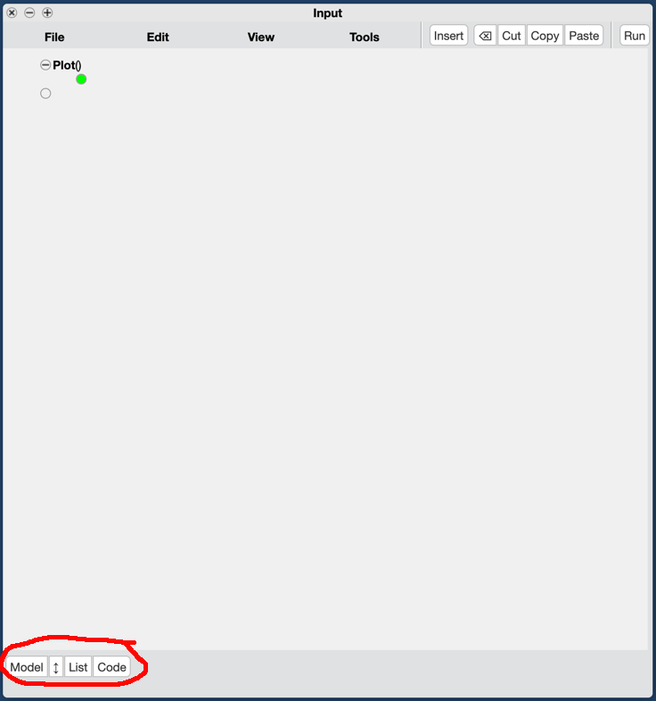
```

```{r oxcal-insert, echo = F, out.width='60%', out.extra='style="float:right; padding:10px"', fig.cap="Inserting dates in the OxCal 'Input' window."}
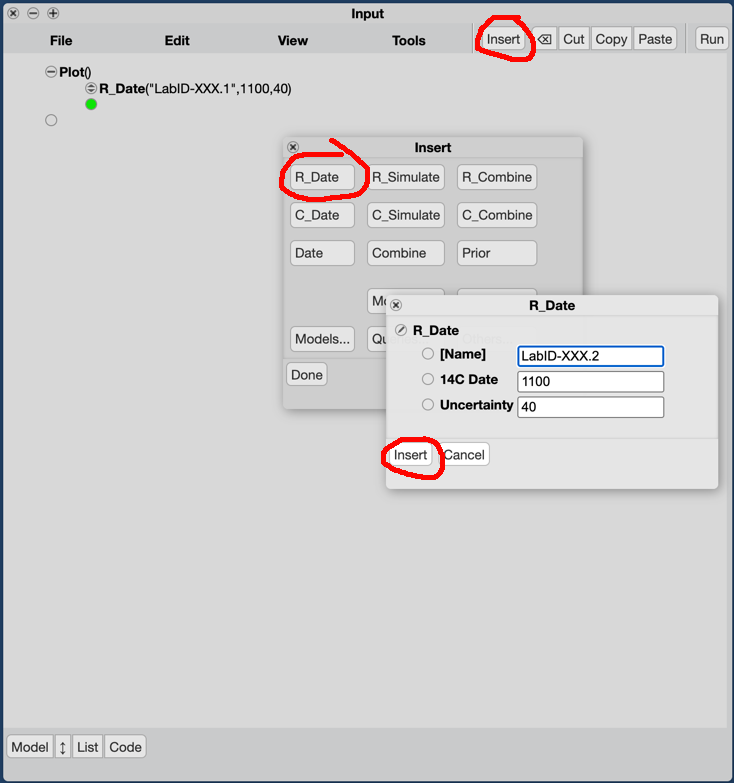
```

```{r oxcal-addcurve, echo = F, out.width='60%', out.extra='style="float:right; padding:10px"', fig.cap="Inputting curves into an OxCal model."}
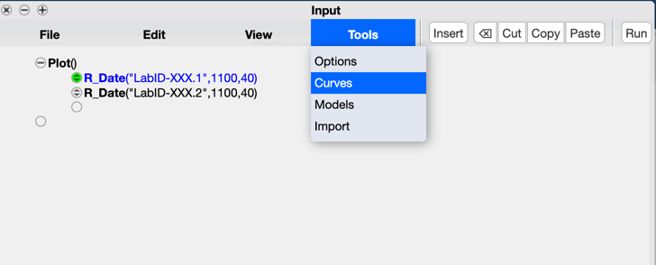
```

The 'Run' button at the upper right of the 'Input' window (or selecting 'File'--\>'Run' from the dropdown) will run your model - which is to say, in this case, calibrate the two radiocarbon dates you've entered, using the two different curves that you've specified. The results will appear in a new window ('Table'). Select 'View'--\>'Plot dates' to see these results and 'View'--\>'Plot stacks' to overlay them. Plots will appear in a new 'OxCal plot' window, where results can be manipulated using the 'Edit' dropdown and downloaded (as .pdf, .png, or .svg image files) with 'File'--\>'Save as'.

```{r echo = F, out.width='50%', out.extra='style="padding:10px"', fig.cap="Plotting results.", fig.show = "hold"}
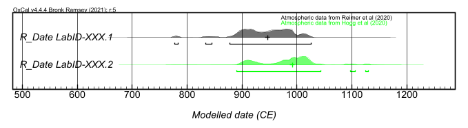

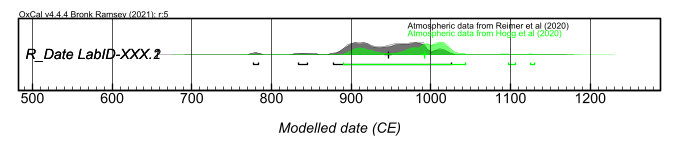
```

#### Calibration at low latitudes

As Figure \@ref(fig:hua-curve) implies, it's not always obvious which calibration curve is appropriate, particularly at tropical latitudes. Atmospheric circulation patterns also vary seasonally: note that Fig. \@ref(fig:hua-curve) illustrates two different - December–February [DJF] and June–August [JJA] locations for the tropical low pressure band [TLPB], which Hua and colleagues prefer to the inter-tropical convergence zone [ITCZ] because it can be more precisely described in terrestrial areas. This is of particular importance for South American archaeology (Figure \@ref(fig:marsh-cc-map)); note how far south the TLPB moves during the austral summer. Atmospheric circulation patterns have also varied over time, since the location of the ITCZ is closely linked to climate changes [see, *e.g.*, @mcgee2014].

```{r marsh-cc-map, echo = F, out.width='100%', out.extra='style="padding:10px"', fig.cap="Proposed calibration curves in South America. Note that these are not intended to be spatially precise."}
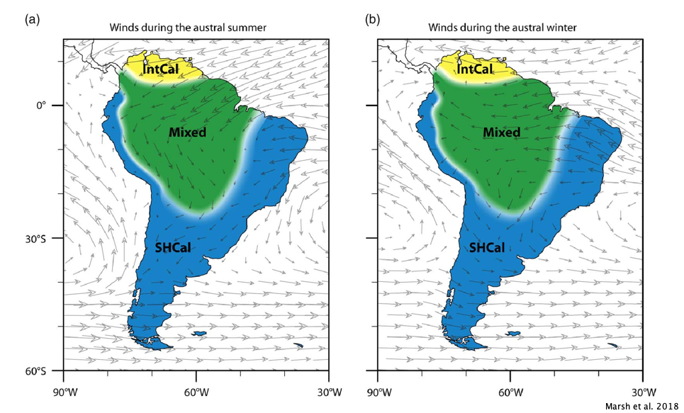
```

As a result, for many locations at low latitudes there will be some uncertainty about which is the appropriate calibration curve. If we don't know, we shouldn't pretend that we do, or we will produce inaccurate age estimates. Marsh and colleagues [-@marsh2018] offer a practical solution that can be applied in OxCal - using a mixed curve that might be any mix of IntCal and SHCal. This will add some uncertainty to age estimates, but if we in fact aren't sure which calibration curve is appropriate, then there *should* be some additional uncertainty. We can illustrate this by adding a third version of our 1100 ±40 date and specifying a mixed calibration curve. We'll do that through the 'Code' view, to get an idea of what raw OxCal code looks like.

### OxCal code

OxCal code, called Chronological Query Language (CQL; the current version is CQL2), built on javascript. If you click on the 'Code' button at the bottom left of the 'Input' window, you'll see this raw input, which looks like this:

```{js out.width='50%'}
 Plot()
 {
  Curve("IntCal20","intcal20.14c");
  R_Date("LabID-XXX.1",1100,40);
  Curve("SHCal20","shcal20.14c");
  R_Date("LabID-XXX.2",1100,40);
 };

```

It can be much more efficient to edit this directly once you're familiar with OxCal code, but - as with any code language - that requires a certain level of comfort and careful attention to detail (dropping a `;` or not closing a `(` will have dire consequences). So you can see what's possible, though, let's add two lines: a new curve, and a third iteration of that same date.

```{js}
 Plot()
 {
  Curve("IntCal20","intcal20.14c");
  R_Date("LabID-XXX.1",1100,40);
  Curve("SHCal20","shcal20.14c");
  R_Date("LabID-XXX.2",1100,40);
  Mix_Curve("Mixed","IntCal20","SHCal20",U(0,100));
  R_Date("LabID-XXX.3",1100,40);
 };

```

Running that model again will produce a third pdf; we can visualize all three with 'View'--\>'Plot dates'. To change the color of the third plot, click on the icon in the 'Edit' column in that row in the 'Table' window. The 'Color' field in the pop-up that appears will reocgnize basic English color names ("blue", "red", etc).

```{r echo = F, out.width='80%', out.extra='style="float:right;padding:10px"', fig.cap="Changing the color of a plotted pdf."}
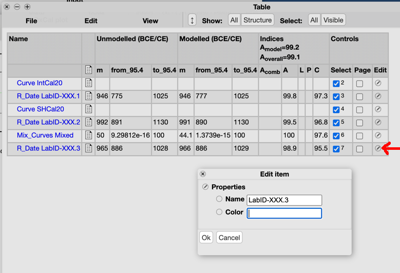
```

This approach calibrates the radiocarbon determination considering what the result would be if the appropriate curve were IntCal20, SHCal20, or any mix of the two. The results, not surprisingly, look like a combination of our first two efforts. If we had other constraints affecting the age estimate, that might push the model towards preferring one curve or the other, or a particular mix. (As will become clear later, when we specify a calibration curve we are asserting a *prior*; this approach avoids that assertion).

```{r echo = F, out.width='80%', out.extra='style="padding:10px"', fig.cap="Plotting results."}
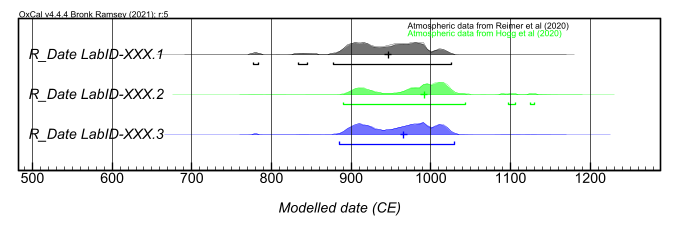
```

From here on, we'll assume that our cemetery is in fact in the Chicama Valley on the Pacific Coast of Peru, where it's clear that the southern hemisphere curve is appropriate. With that in mind, let's return to our sample of 20 burials. This time, rather than considering age estimates based on ceramics or other diagnostic material culture from those 20 burials, we'll examine radiocarbon dates.

```{r echo = F, results = 'hide', warning=F, message=F}
bur20_sim <- rcarbon::uncalibrate(bur20$ages, calCurves = "shcal20", CRAerrors = round(rnorm(20, mean = 30, sd = 5), 0)) %>%
  select(calBP, rCRA, rError) %>% rename(c14age = rCRA, c14std = rError) %>% 
  mutate(ID = paste("LabXX", sprintf('%0.2d', 1:20), sep = "-"))

#or simulate using oxcAAR
setOxcalExecutablePath("/Applications/OxCal/bin/OxCalMac")
oxcalCalibrate(5000,25,"KIA-12345")
#edited version of oxcalSimulate() to allow specification of curve
oxcalSimulate_cc(-3400, 25, "SimDate_1", "SHCal20")

bur20_oxsim <- oxcalSimulate_cc(bur20$ages, std = round(rnorm(20, mean = 30, sd = 5), 0), 
                           names = paste("LabXX", sprintf('%0.2d', 1:20), sep = "-"), cc = "SHCal20")
ages <- bind_rows(lapply(bur20_oxsim, '[[', 3)) %>% 
  pivot_longer(names_to = "ID", cols = everything(), values_to = "c14age") %>% 
  filter(is.na(c14age) == F)

errors <- bind_rows(lapply(bur20_oxsim, '[[', 4)) %>% 
  pivot_longer(names_to = "ID", cols = everything(), values_to = "c14std") %>% 
  filter(is.na(c14std) == F)

bur20_sim <- ages %>% left_join(errors) %>% mutate(calBP = bur20$ages)


```

```{r echo = F, results = 'hide', warning=F, message=F}

#check simulated dates
# bur20_sim %>% mutate(cal = c14_calibrate(rCRA, rError, cc = 3))
#or
bur20_sim %>% mutate(cal = c14_calibrate(c14age, c14std, cc = 3))

#or in more detail
bur20_sim_lst <- bur20_sim %>% 
  as.c14_date_list() %>% c14bazAAR::calibrate(calCurves = rep("intcal20", nrow(bur20_sim)), 
                                   choices = c("calprobdistr", "calrange"))

bur20_sim_lst_calrange <- bur20_sim_lst %>% tidyr::unnest(cols = c("calrange"))

# ggplot() +
#   geom_segment(
#     data = bur20_sim_lst_calrange,
#     mapping = aes(y = 1, yend = 1, x = -to + 1950, xend = -from + 1950), alpha = .5,
#     arrow = arrow(length = unit(0.1,"cm"), ends = "both", angle = 90), linewidth = 1
#   ) + 
#   xlim(600, 1300) +
#   xlab("age calBC/calAD") +
#   ylab("uncalibrated age BC/AD") +
#   theme_minimal()


bur20_sim_caldens <- bur20_sim_lst %>% tidyr::unnest(cols = c("calprobdistr"))

#stack plots
# bur20_sim_caldens %>% mutate(site = "HCV") %>% 
#   ggplot() +
#   ggridges::geom_ridgeline(
#     aes(x = -calage + 1950, y = site, height = density, group = interaction(c14age, site)), alpha = .5,
#     scale = 100
#   ) +
#   xlab("age calBC/calAD") +
#   ylab("dates") +
#   theme_minimal()


bur20_sim_caldens %>% 
  ggplot() +
  ggridges::geom_ridgeline(
    aes(x = -calage + 1950, y = ID, height = density, group = ID),
    scale = 100
  ) +
  xlab("age calBC/calAD") +
  ylab("dates") + 
    # plot original calendar dates with each 14C date
  geom_point(aes(y = ID, x = calBP), shape = 3, color = "red") +
  theme_minimal()


bur20_sim %>% select(-calBP) %>%  #mutate(ID = paste("LabXX", sprintf('%0.2d', 1:20), sep = "-")) %>% relocate(ID, .before = rCRA) %>%
  write.csv("data/bur20sim.csv", row.names = F)

```

#### Importing data into OxCal

If you still have the previous model in your 'Input', either delete it or open a new model. Efficiently calibrating multiple dates is *extremely* useful. Open (`bur20sim.csv`)[https://dcontre.github.io/radiocarbon_workshop/data/bur20sim.csv] however you like (MS Excel or something like it will work fine). Select and copy all of the rows (excluding the column names). Return to OxCal, and in the 'Input' window, choose the 'Tools'--\>'Import' dropdown (Figure \@ref(fig:oxcal-import)). In the 'Import' window that pops up, make sure that 'Command' is selecting "R_Date", and 'Separator' is "Tab", and paste your data into the 'Data' space (column order matters; OxCal expects `Name | Radiocarbon age | Error`). When you click the 'Insert' button, these will be added to your model at whichever dot you have selected in the 'List' view. Make sure that you insert a line specifying SHCal20 as the curve at the beginning (or, in the 'List' interface, with 'Insert'--\>'Others'--\>'Curve'), so that your complete code looks like this:

```{js}
  Plot()
 {
  Curve("SHCal20","shcal20.14c");
  R_Date("LabXX-01",896,31);
  R_Date("LabXX-02",940,36);
  R_Date("LabXX-03",1188,29);
  R_Date("LabXX-04",896,32);
  R_Date("LabXX-05",1106,30);
  R_Date("LabXX-06",1087,26);
  R_Date("LabXX-07",1012,27);
  R_Date("LabXX-08",1148,31);
  R_Date("LabXX-09",1094,29);
  R_Date("LabXX-10",1047,31);
  R_Date("LabXX-11",1128,36);
  R_Date("LabXX-12",990,31);
  R_Date("LabXX-13",951,31);
  R_Date("LabXX-14",1197,29);
  R_Date("LabXX-15",1134,33);
  R_Date("LabXX-16",989,30);
  R_Date("LabXX-17",946,33);
  R_Date("LabXX-18",1185,15);
  R_Date("LabXX-19",1143,29);
  R_Date("LabXX-20",1141,31);
 };

```

Note that the 'Curve' command at the beginning loads a calibration curve, which defaults to IntCal20 if you don't specify anything. If you *do* specify a curve, OxCal (which reads from top to bottom) will keep using the last one invoked until you specify otherwise. You can call previously loaded curves using the 'Tools'--\>'Curves' dropdown.

```{r oxcal-import, echo = F, out.width='60%', out.extra='style="padding:10px"', fig.cap="Importing multiple dates."}
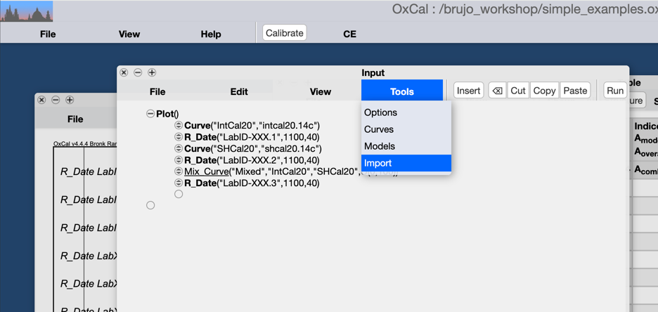
```

Calibrate these dates ('Run') and then plot them ('View'--\>'Plot dates' and/or 'View'--\>'Plot stack'). The stack helps visualize the patterns that you may see in the individually plotted pdfs.

```{r echo = F, out.width='100%', out.extra='style="padding:10px"', fig.cap="Plotting multiple dates."}
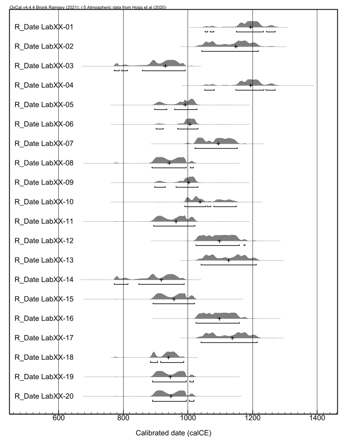
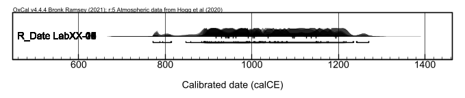
```

Using these plots of calibrated dates, let's return to our questions about the cemetery:

-   When did use as a cemetery begin?
-   For how long was the area used as a cemetery?
-   When did use as a cemetery end?
-   Was there a period of more intense use, and if so when and for how long?

```{r, echo = F, results = 'hide'}
simdate_extremes <- bur20_sim_lst_calrange %>% group_by(ID) %>% summarize(mindate = min(-to + 1950), maxdate = max(-from + 1950)) %>% 
  summarize(datemin = min(mindate), datemax = max(maxdate))
```

#### Visual inspection of calibrated $^{14}C$ determinations.

As Bayliss and colleagues [-@bayliss2007, 8-9] discuss in detail, visual inspection of assemblages of radiocarbon dates almost inevitably leads to overestimation of the spans of time that produced those assemblages. If we take the maximum and minimum of the 95% HDRs, we get `r simdate_extremes$datemin` - `r simdate_extremes$datemax`. A similar but less precise estimate - the one most archaeologists would probably give - based on visual inspection of the calibrated ranges would likely be something like, "about 850 CE to a bit after 1200 CE".

`r colorize("But in fact our simulated $^{14}C$ ages are from samples drawn from a uniform distribution covering the interval **800 - 1100 CE**.", "red")`

```{r echo = F, fig.cap = "Calendar dates and simulated radiocarbon dates."}

bur20_sim_caldens %>% 
  ggplot() +
  ggridges::geom_ridgeline(
    aes(x = -calage + 1950, y = ID, height = density, group = ID),
    scale = 100
  ) +
  xlab("age calBC/calAD") +
  ylab("dates") + 
    # plot original calendar dates with each 14C date
  geom_point(aes(y = ID, x = calBP), shape = 3, color = "red") +
  theme_minimal()
```

#### Bounded Phase models in OxCal {#phase_models}

This problem of overestimation stems from the visual impact of the uncertainty plotted as the pdf of a calibrated date, which is often (mis)interpreted as a span of time rather than a distribution of probability. That is, if we treated these distributions as indicated a span *within which* activity occurred, we'd probably be mostly right. When we try to interpret it as a span that indicates when use began and ended, then we're very likely to be wrong. OxCal addresses this problem of overestimation with the 'bounded phase model'. A bounded phase model treats the specified dates as a sample drawn from (by default) a uniform distribution that is defined by the boundaries. In practice this means taking into account the fact that a) the limited precision with which we can describe dates produces additional scatter, and b) it's unlikely to draw many samples from the extremes of a distribution. This assertion of a *uniform prior* is fundamental to OxCal's logic, and underlies some of its most important results: improved estimation of timespans in the vast majority of cases. If we have no basis from which to assert some other parent distribution of our samples, then a uniform ("uninformative") prior is very likely the best choice. However, if there's reason to think that another prior better describes the population of dateable events that we have sampled - in our cemetery case, we might for instance suspect based on ceramic styles that the frequency of interments increased over time - then it's a good idea to explicitly incorporate that information by asserting it as a prior (i.e., by modeling a non-uniform phase; more on that later).

> It almost certainly gives us a more realistic interpretation of the given information although we have made an extra (and possibly difficult to substantiate) assumption. To use no model at all is in fact to assume that all of the events are truly independent; this is in effect a model in itself, and in many cases a very unreasonable one. [@bronkramsey1998]

In practice this means adding three commands (incidentally, you can review OxCal's commands by selecting 'Help' and then 'Command reference'): `Sequence`, `Boundary`, and `Phase`. `Sequence` asserts that the events that follow (within the `{}` that follow, in the code) are in chronological sequence; `Boundary` commands are used in pairs to define the events that should be considered as sampled from a discrete distribution (by default a uniform one, as noted above); `Phase` describes (also within the `{}`that follow) events whose relative sequence is unknown (if we knew - based on, *e.g.*, stylistic grounds - that one dated burial was the earliest, we could place it before the `Phase` command in the sequence). So, the entire sequence laid out below can be read as, "here are a pair of sequential boundaries; these describe a collection of dated events (whose relative sequence is entirely unknown) as a random sample from a uniform distribution of dateable events".

You can build a bounded phase model from scratch by using the 'Insert' button in the 'Input' window and/or by editing the code directly. You can also 'Tools'--\>'Models'--\>'Phases' to insert the entire structure (Sequence, Boundaries, and Phase), and then populate that with dates. That structure (including a line establishing that we will use SHCal20), looks like this, for a phase called "Cem 1":

```{js}
 Plot()
 {
  Curve("SHCal20","shcal20.14c");
  Sequence()
  {
   Boundary("Start Cem 1");
   Phase("Cem 1")
   {
   };
   Boundary("End Cem 1");
  };
 };
```

Move your radiocarbon dates (all the `R_Date();` lines) so that they are inside the Phase command. Before we run the model we'll also add two *queries* that will make it easier to assess the results: a `KDE_Plot` command (found under 'Insert', then 'Models'), and an `Interval` command, both of which should be placed inside the `Phase` command. `Interval` will estimate the span of time between the boundaries, and `KDE_Plot` will produce a summary of the dated events in the phase. Your complete code should look like this:

```{js}
 Plot()
 {
  Curve("SHCal20","shcal20.14c");
  Sequence()
  {
   Boundary("Start Cem 1");
   Phase("Cem 1")
   {
    R_Date("LabXX-01",896,31);
    R_Date("LabXX-02",940,36);
    R_Date("LabXX-03",1188,29);
    R_Date("LabXX-04",896,32);
    R_Date("LabXX-05",1106,30);
    R_Date("LabXX-06",1087,26);
    R_Date("LabXX-07",1012,27);
    R_Date("LabXX-08",1148,31);
    R_Date("LabXX-09",1094,29);
    R_Date("LabXX-10",1047,31);
    R_Date("LabXX-11",1128,36);
    R_Date("LabXX-12",990,31);
    R_Date("LabXX-13",951,31);
    R_Date("LabXX-14",1197,29);
    R_Date("LabXX-15",1134,33);
    R_Date("LabXX-16",989,30);
    R_Date("LabXX-17",946,33);
    R_Date("LabXX-18",1185,15);
    R_Date("LabXX-19",1143,29);
    R_Date("LabXX-20",1141,31);
    KDE_Plot("Cem 1 KDE");
    Interval("Cem 1 interval");
   };
   Boundary("End Cem 1");
  };
 };
```

Once you've run the model, two aspects of the results are important to review: 1) the effects of the model on the estimated ranges for each radiocarbon date, and 2) the estimated parameters for the phase as a whole. Select 'View'--\>'Plot dates' to review the results (you may need to select 'Edit'--\>'Adjust' to change the plot size).

```{r simphase-results, echo = F, out.width='100%', out.extra='style="padding:10px"', fig.cap="Plotting a phase model."}
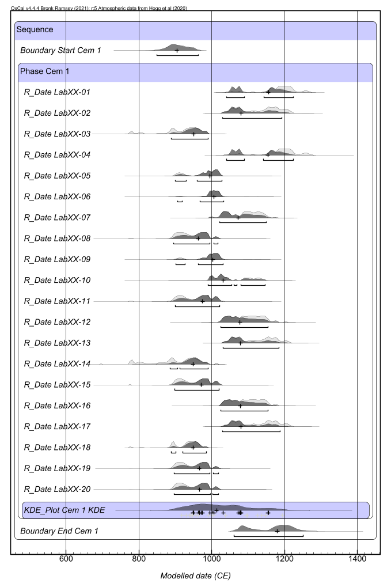
```

You'll notice that each radiocarbon date is now described by two superimposed pdfs. In `r colorize("**grey**", "light grey")` is the calibrated date (the "prior distribution", because it was the information that we used as *input* for our model), and in `r colorize("**black**", "black")` is the modeled result (the *posterior distribution*, because it is calculated by revising the priors according to model parameters). We have used few priors here, so the differences we're seeing between prior and posterior distributions reflect only the effects of the bounded phase model: the early and late extremes are constrained, correcting for the scatter introduced by imprecision. We can best review the results for the phase as a whole by limiting the plot to just the key items. Return to the 'Table' window, and, using the check-boxes in the 'Select' column, select *only* the boundaries and the KDE_Plot. I like to change the colors of the boundaries as well, to distinguish them. The KDE is a modeled approximation of the distribution from which our dated events came [@bronkramsey2017a] (a formal version of the stacked plot). The black `r colorize("**'+'**", "black")` below are the medians of the posterior distributions that go into it, and the grey `r colorize("**'+'**", "lightgrey")` below (hard to see on the blue background in the default color scheme) are the medians of the unmodeled dates. The boundaries are modeled estimates of the beginning and terminus of the parent distribution - remember that we're using our dated events to try to reconstruct the *population* of dated events which we've sampled, which is to say all the potentially dateable events; in the case of our cemetery, all the interments. Like the pdf that described an individual calibrated date, these are curves describing the uncertainty with which we can estimate these dates. So, referencing Figure \@ref(fig:oxcal-kde) and the 'Table' window, we can say with 95% confidence that our phase began between 850 and 965 CE (rounding a bit), and ended between 1060 and 1250 CE.

```{r oxcal-kde, echo = F, out.width='100%', out.extra='style="padding:10px"', fig.cap="KDE and boundaries."}
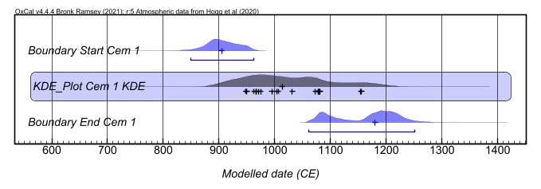
```

If you look at the results of the 'Interval' query in the 'Table' window, you'll find that the 95% confidence interval is 113-381 years, with a median of 276 years. That is a corollary of the boundaries, and the phase model's answer to our question of how long the cemetery was in use. It varies quite a bit for two reasons: we don't have a huge number of samples, and we have no information with which to constrain the initial and terminal dates (no dated events that predate and postdate cemetery use). If we could add those, our estimate would get more precise.

How good are our results? Well, if we take the medians of the boundaries (not ideal for describing the bimodal distribution of the end boundary, but efficient), we'd say that our phase began around 900 CE and lasted until about 1180 CE. The end might come with a caveat: there's a good chance that it's about 90 years earlier; we can tell from the KDE that really there are only one or two dates that are pushing our end date forward. Knowing as we do that our initial dated events were sampled from a uniform distribution extending from 800-1100 CE, we can tell that we are victims of some bad luck in our sampling. We haven't sampled any early burials, and we got one late date that seems to be the result of a radiocarbon age intersecting a wide calibrated range (see \@ref(fig:simphase-results); these are likely LabXX-02 and LabXX-04). The problem, of course, that if we weren't working from simulated data, we'd have no way to know that our results were inaccurate - a good illustration of the kinds of uncertainties that are difficult to escape in any chronological model.

#### Simulating radiocarbon samples in OxCal

If you want to explore these uncertainties further, you can re-run this example with different simulated dates. The `R_Simulate` command in OxCal randomly generates a radiocarbon age that *might result* from a given calendar age. You can use 'Insert'-->'R_Simulate' or edit code directly to produce generate multiple radiocarbon dates from the same calendar date, for example.  

```{js}
 Plot()
 {
  Curve("SHCal20","shcal20.14c");
  C_Date("Date of death", 1074, 1);
  R_Simulate("Sim1", 1074, 25);
  R_Simulate("Sim2", 1074, 25);
  R_Simulate("Sim3", 1074, 25);
 };
```

```{r echo = F, out.width='100%', out.extra='style="padding:10px"', fig.cap="Multiple simulated dates from the same calendar date will vary!"}
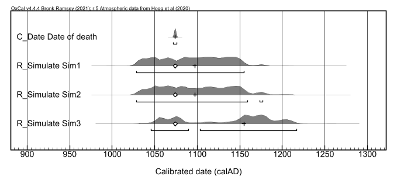
```

### Introducing real-world complications

So far we have ignored a fundamental question: *what have we dated?*

The question of what we have dated is on its face a question about material: which materials - of the variety available, illustrated in Figure \@ref(fig:burial1192) - were sampled and sent for radiocarbon analysis? More fundamentally, it is a question about the relationship between *target event* and *dated event*. That is, a) what is the event whose date we are attempting to estimate, b) what is the event whose radiocarbon age is measured, and c) are (a) and (b) the same? Given the [questions that we have framed about the cemetery](#cemetery), (a) is the moment of interment: we are hoping that the radiocarbon ages that we get on samples from various burials will tell us relatively precisely when those individuals were buried. What (b) is depends very much on the specific sample; it might match (a) closely, or diverge by as much as centuries.

The problem is not unique to radiocarbon: typological dating of an interment can be confounded by the use of heirloom objects as burial goods, for example, while secondary burial and tomb-reentry are fundamentally challenges that should be met through methods of excavation (and documentation).

Three types of problems are most common: old wood, residence time, and marine reservoir effects.

#### old wood

Trees are often long-lived organisms whose growth occurs in discrete (often but not necessarily annual) increments - tree rings. Their tissue incorporates atmospheric carbon through photosynthesis across the entire lifespan of the tree; each ring is in equilibrium with atmospheric carbon at the time that it is formed. In consequence, interior rings will have a radiocarbon age (and in fact a calendar age) greater than that of exterior rings. In the case of wood recovered in archaeological context (*e.g.*, timber in construction), the date of interest is usually the moment of harvest. Unless the outermost rings (or small twigs) are sampled, however, there is a risk that the estimated age may be much older - as much as centuries older, in the case of long-lived species. In Figure \@ref(fig:redwood), a sample from rings laid down around 570 CE would (and should!) have a very different radiocarbon age than a sample from rings laid down around 1492 CE.

```{r redwood, echo = F, out.width='100%', out.extra='style="padding:10px"', fig.cap="Cross-section of a California redwood (*Sequoia sempervirens*) that sprouted in 544 CE and fell in 1936 CE. A 1cm$^{3}$ wood sample from near the center of the trunk would - accurately - produce a radiocarbon age >1000 years older than one near the bark."}
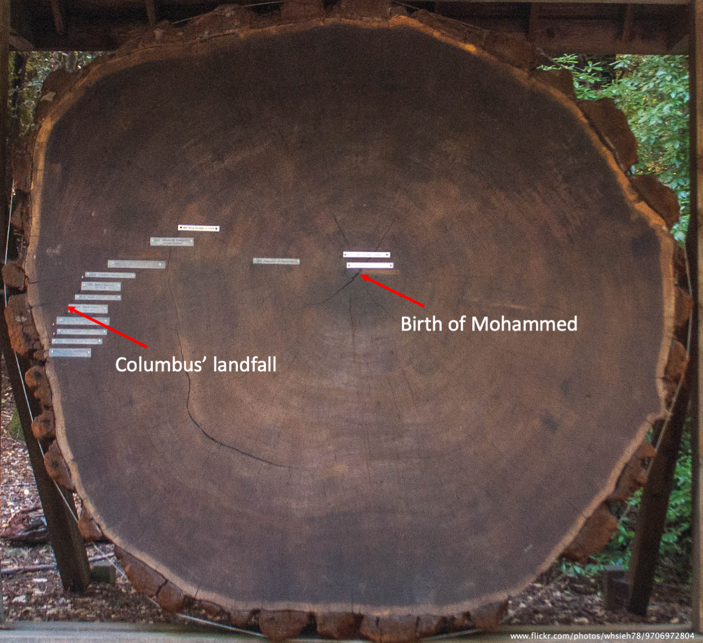
```

#### residence time

The issue of residence time is often conflated with the problem of old wood, but is in fact a distinct confounding factor for age estimates. Problems of residence time stem from the persistence of organic materials on the landscape for significant spans of time after the death of the source organism, before incorporation into cultural contexts. Particularly in arid environments, carbonized, woody, and/or even herbaceous tissue can preserve very well and be available for collection for decades or even centuries. These preserved materials can either be deliberately harvested and incorporated into cultural deposits, or can be incidentally harvested when other materials are collected.

#### marine reservoir

Note that the illustration of the carbon cycle (Figure \@ref(fig:velarde-fig)) includes exchange between ocean and atmosphere. This exchange, because oceans constitute a much greater proportion of the southern hemisphere than the northern, is a contributor to the [contrast in atmospheric $^{14}C$ between hemispheres](#curves). The amount of ocean-atmosphere exchange is significant because the oceans (and other bodies of water, though we won't cover freshwater here) contain "old" carbon, which is to say carbon \>55kya, with no $^{14}C$ remaining. Globally, surface water in the oceans is \~400 radiocarbon years older than the atmosphere; where upwelling introduces deeper water and correspondingly more old carbon, the offset can be greater. The age of marine carbon can have both direct and indirect impacts on radiocarbon ages of archaeological materials. Organisms that derive some or all of the carbon in their tissues from marine rather than atmospheric sources will be incorporating carbon with greater apparent age. If the offset between marine carbon and atmospheric carbon at the time and place of tissue formation were known, it would be straightforward to calculate the calendar age of a sample even if its carbon were marine in origin. Complications arise because the offset between marine and atmospheric carbon is variable in space and time, and because organisms may incorporate carbon from a mixture of different reservoirs. Ideally this is managed by establishing the local offset from the global marine average (the Marine20 calibration curve [@heaton2020]) for the period of interest. Establishing that globally, even for recent times, is complicated by post-1945 atomic testing. A regularly updated database of radiocarbon measuremnts on pre-bomb marine samples of known age [@reimer2001marine] is available at [calib.org](http://calib.org/marine/). It is, however, sparse for many regions globally, including coastal Peru (Figure \@ref(fig:peru-shells)). It alo consists primarily of early $20^{th}$-century materials, meaning that it cannot account for past variations in $\Delta{R}$. Since $\Delta{R}$ is sensitive to strength of upwelling, past variation is to be expected, particularly given the effects of ENSO on upwelling off the coast of western South America [@jones2010].

```{r peru-shells, echo = F, message = F, fig.cap = "Data in calib.org/marine for coastal Peru, as of 08/2024."}
peru.shells <- map.shells(S=-15, W=-82, N=-4, E=-75, currents = F) 
```

The preferred solution for archaeological questions is to date paired marine and terrestrial samples from the region and time period of interest - that is, from the same context and believed to be of the same age - in order to directly establish the relevant $\Delta{R}$. While this should improve age estimates, however, the multiple uncertainties involved in such a project are likely to make dating samples with marine reservoir offsets useful only if the underlying chronological questions do not require high precision. Bayliss and Marshall [-@bayliss2022, 40] go so far as to drily advise that, "the best policy for dealing with samples that exhibit reservoir effects is avoidance".

```{r echo = F, message = F}
myshells <- map.shells(S=-10, W=-80.5, N=-6, E=-78, currents = F) 
shells.mean(myshells)

```

##### dietary offsets {#diet}

Marine reservoir effects impact more than just marine organisms. Animals - including humans - derive the carbon used to build tissue from the the organisms that they consume (similarly, marine and aquatic plants, if even partially submerged, are likely to derive at least some of their carbon from non-atmospheric reservoirs). Animals that consume marine organisms thus derive some of their carbon from marine reservoirs. If 50% of their diet is marine, then 50% of their carbon will be marine, and the appropriate calibration curve would be a 50/50 mix of atmospheric (IntCal20 or SHCal20) and marine (Marine20, adjusted for local $\Delta{R}$). Estimating the dietary inputs of the organism from which a dated sample is derived can thus be a key consideration. This is most commonly an issue for dates on human tissue in coastal settings. In such cases either greater uncertainty has to be built into the age estimate, or some approximation of the relative contribution of different reservoirs established. The latter generally is derived from measurements of stable carbon and nitrogen isotopes [@richards2020], which in combination are used to estimate long-term sources of dietary protein (Figure \@ref(fig:diet-estim)) using mixing models (e.g., the *R* packages **simmr** [@govan2024] and **MixSIAR** [@stock2018]).

```{r diet-estim, echo = F, out.width='100%', out.extra='style="padding:10px"', fig.cap="Proportion of diet derived from marine sources can be estimated using C and N isotopes."}
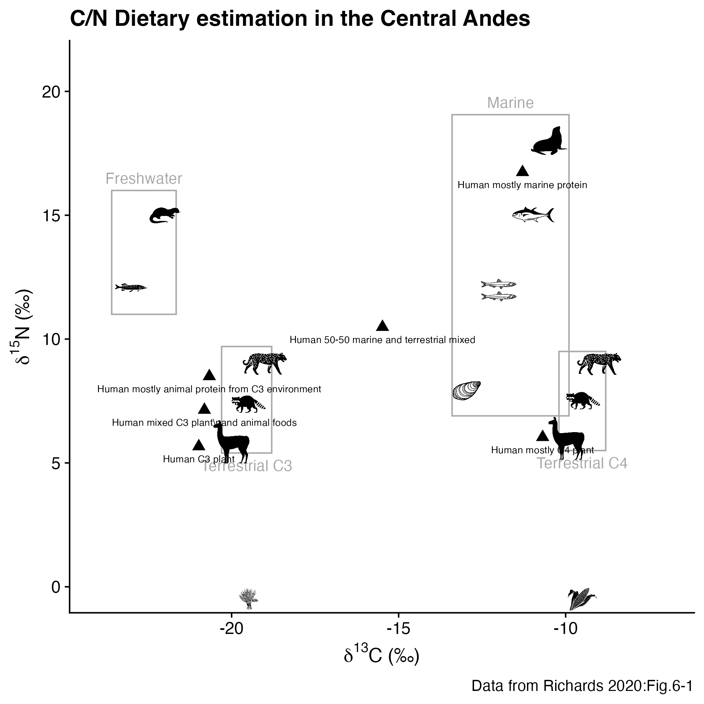
```

Because these estimates come with their own uncertainties - a typical output of a mixing model is an estimate of % marine contribution to diet something like "42 ±25" - they tend to produce age estimates that, while more accurate than those calculated with the wrong curve, are less precise. Consider, for example, the first of the simulated dates that we have used above (LabXX-01): for a calendar age of 1074 CE we generated a simulated $^{14}C$ age of 925 ±28 using a southern hemisphere reservoir, which we calibrated with SHCal20 to produce a 95% HDR of 1052 - 1269 CE (Figure \@ref(fig:labxx-01)).

```{r labxx-01, echo = F, warning = F, message = F, fig.height = 3, fig.cap = "Calendar age of 1074 CE, simulated $^{14}C$ age of 925 ±28, calibrated with SHCal20."}
# bur20_sim
rice::calibrate(925, 28, BCAD = T, cc = 3)
points(1074, 695, col = "skyblue", pch = 3, cex = 1.5, lwd = 2)
```

What if we instead consider sample LabXX-01 to be a sample of human bone, from an individual whose diet was 50% marine, who died in 1074 CE?

```{r echo = F, out.width='100%', out.extra='style="padding:10px"', fig.cap="Effects of 50% marine diet on a calibrated age estimate."}
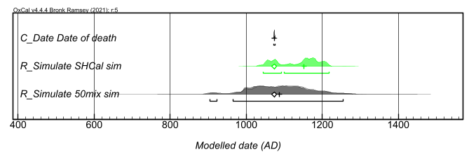
```

Introducing reservoir complications obviously degrades the precision of any age estimate - and this is assuming that we *know* the % marine diet and the local $\Delta{R}$! In fact we should probably consider scenarios where the sample incorporates at least some carbon from the marine reservoir, *but we don't know how much* and we may not not know the right correction to apply (i.e., the local $\Delta{R}$). Let's examine three scenarios where the dated individual died in 1074 CE, and consumed a diet that was 50% marine:

-   We don't know anything about this individual's diet, but either consider a marine dietary component *unlikely* or simply don't consider the issue at all, and calibrate the radiocarbon result using only the atmospheric curve (SHCal20, in this case), as we would for any other terrestrial sample. (Figure \@ref(fig:marinesim), 01a)
-   We don't know anything about this individual's diet, but consider it *likely* that they had a significant marine dietary component, and realize that our calibration should account for this. We know the local $\Delta{R}$ is -200 ±75 years, and can thus model the effects of a diet that might range anywhere from 0 - 100% marine. (Figure \@ref(fig:marinesim), 01b)
-   Based on the C/N isotopic composition of the sampled bone and the application of a mixing model, we are able to estimate that their diet was 50 ±20% marine, and we know the local $\Delta{R}$ is -200 ±75 years. (Figure \@ref(fig:marinesim), 01c)

```{r marinesim, echo = F, out.width='100%', out.extra='style="padding:10px"', fig.cap="Effects of different assumptions about a 50% marine diet on a calibrated age estimate."}
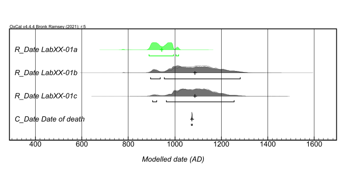
```

It should be clear that the worst possible scenario is one where we make the wrong assumption about the reservoir effects in this sample. In that case (01a), we get a relative precise answer...but one that is significantly inaccurate. For an individual that died in 1074 CE, we produce an estimate with a median of 943 CE and a 95% HDR of 889-995 (92%) and 1006-1017 (4%). In contrast, if we can approximate the marine dietary input (01c), we can produce an *accurate* result, but one that - as a result of accumulating uncertainties - is of notably low precision (median of 1088 CE and a 95% HDR of 905-923 (1%) and 963-1255 (4%)). In case we know even less about diet and/or local $\Delta{R}$, we can produce an estimate that is accurate but even less precise (01b).

Bayliss and Marshall's [-@bayliss2022, 40] dictum - "the best policy for dealing with samples that exhibit reservoir effects is avoidance" - begins to look even more reasonable. However, we may find ourselves with few other options when it comes to dateable material, or may wish to work with legacy dates, so avoidance is not always an option. Being explicit about what we know and don't know about a given sample is, as a result, crucial to understanding how to interpret an age estimate.

#### *dated event* vs. *target event*

The accuracy and precision with which we can use radiocarbon to estimate the age of an event (by, *e.g.*, selecting the appropriate calibration curve) is only one of the relevant challenges. Understanding just which event it is whose age we have estimated, and how that age relates to the one in which we are in fact interested, is a fundamental (and under-appreciated) challenge.

Recall our two key questions:

1.  What is the event whose age we wish to know (the *target event*)?
2.  For which materials from this context might we be able to estimate an age using radiocarbon?

We can add a third crucial question:

<details>

<summary><b>3. What event will we be dating if we produce a radiocarbon age estimate of a particular material (the *dated event*)?</b></summary>

One of the basic principles of radiocarbon dating is that the *dated event* will be the moment when the organism ceased incorporating atmospheric carbon into tissue. That is generally glossed as the death of the organism (though reality can be messier).

</details>

What would be the likely dated events for the various materials in Burial 11/92? How do they relate to the moment of interment (which, we have asserted above, is the event of archaeological interest [i.e., the *target event*])?

<details>

<summary><i>- ceramics </i></summary>

A radiocarbon date will give the date of harvest of any plant matter used as temper and/or organic residues absorbed when the vessel was used to store or cook organic materials. If the date is a bulk date (i.e., on all organic material in the sherd, combined), it will not be possible to tell which of these is contributing to the result. If residues include marine (or freshwater) products, marine (or freshwater) reservoir effects may have to be considered.

</details>

<details>

<summary><i>- gourd (*Lagenaria siceraria*) </i></summary>

A radiocarbon date will give the date of harvest of the gourd. Assessment of how likely that date is to be close in time to the moment of interment will be required.

</details>

<details>

<summary><i>- textile fragment </i></summary>

A radiocarbon date will give the date of harvest of the fibers used in manufacturing the textile. How long are fibers likely to be stored after harvest, and how long before incorporation into a burial are textiles likely to be manufactured? A textile produced for a funerary bundle will give a different date than a textile repurposed as a shroud...or an heirloom textile.

</details>

<details>

<summary><i>- wood (algarrobo, *Prosopis pallida*) </i></summary>

A radiocarbon date will give an average of the dates on which the growth rings that constitute the sample were formed. If an exterior ring is sampled and the trunk or branch was harvested while living, this will be the date of harvest. If interior rings are sampled and/or the wood was already dead when harvested and/or the wood was used for some span of time post-harvest but pre-burial, the dated event may be as much as centuries before interment.

</details>

<details>

<summary><i>- marine shell </i></summary>

The carbon in marine shell is derived from marine sources, and so a radiocarbon determination on marine shell should be calibrated using the Marine20 curve [@heaton2020] rather than IntCal20 or SHCal20, plus any additional local ${\Delta}R$ correction available. If a local correction is available, a date on marine shell should produce an accurate calibrated result that reflects the date of death of the organism. How close the date of death is to the date of deposition will likely depend on the use to which the shell was put (consider the likely difference, for example, between *Donax spp.* and *Spondylus spp.* in this context).

</details>

<details>

<summary><i>- human bone </i></summary>

Burial 11/92 appears to contain not only a individual and associated material culture, but also additional long bones. While the primary individual likely died not long before burial - though this is an assumption worth examining - additional skeletal elements (like a secondary burial) may have already been old at the time of interment. Understanding the depositional history of the material we are sampling may thus be crucial to assessing the relationship between dated event and target event (and so making accurate age estimates). In the case of human bone, age and dietary offsets may also have to be considered.

*age offset*

Age-at-death offsets result from the persistence in bone collagen of carbon derived from materials consumed over several years or even decades before the death of the organism (i.e., bone collagen is not a snapshot of the carbon consumed immediately before the moment of death). If an organism is sufficiently old (more than \~3 decades), carbon in bone collagen may not be in equilibrium with atmospheric carbon at the time of death. However, we are rarely working at a level of precision sufficiently high for such offsets to be relevant.

*dietary offset*

As detailed [above](#diet), where an individual's diet has incorporated marine protein, the carbon in their tissue will be derived from marine as well as atmospheric reservoirs, and calibration with a mixed curve - as well as accounting for any local $\Delta{R}$ - will be necessary. Even where all these parameters are known, the resulting estimate will likely be less precise than for a sample for which only the atmospheric reservoir has to be taken into account.

</details>

<details>

<summary><i>- camelid bone </i></summary>

As with human bone, the first question with respect to faunal bone will be how the dated event - death of the animal - relates to the moment of deposition.

Note that not all faunal bone should be considered comparable. Marine mammals - or terrestrial mammals consuming marine products - will have dietary offsets. In cases where individuals are mature and species are long-lived (more than a few decades), age offsets (see above) may also be relevant.

</details>

<details>

<summary><i>- caña brava (*Gynerium sagittatum*) </i></summary>

A radiocarbon date will give the date of harvest of the cane. Assessment of how likely that date is to be close in time to the moment of interment will be required.

</details>

<details>

<summary><i>- unidentified wood charcoal </i></summary>

A radiocarbon date will give an average of the dates on which the growth rings that constitute the sample were formed. If an exterior ring is dated and the trunk or branch was harvested while living, this will be the date of harvest. If interior rings are sampled and/or the wood was already dead when harvested and/or the wood was used for some span of time post-harvest but pre-carbonization and/or the burn event predated the burial event, the dated event may be as much as centuries before interment.

</details>

Understanding what the dated event is and assessing how it related to the target event is fundamental to accurate age estimates. If the difference between dated event and target event is known or can be estimated, then a radiocarbon determination can still produce a useful age estimate. If the difference between the two is unknown, then the radiocarbon determination can only provide an uncertain age estimate, one that accounts for the greatest possible offset between dated event and target event. Suppose for example that the burial described above turns out to also contain a wooden figurine (Figure \@ref(fig:broken-ear)). In order to accurately estimate the moment of deposition from a radiocarbon age estimate of that wood, we would need to estimate 1) the age of the wood when harvested (i.e., which part of the tree was used, and how old that wood might have been), 2) the amount of time that passed between the death of the tree (if it preceded harvest), harvest of the wood, and the carving of the object, and 3) the amount of time elapsed between carving of the figurine and its deposition in the burial. This is asking a lot - but if we *could* estimate those, we could adjust the radiocarbon age by applying an estimated offset, and come up with an estimated date of deposition. As with dietary offsets for bone samples, applying an age offset is likely to incorporate additional uncertainty, and consequently reduce the precision of our age estimate.

```{r broken-ear, echo = F, out.extra='style="float:right; padding:10px"', fig.cap = "Wooden figurine."}
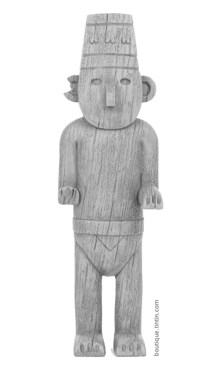
```

(In fact, examining Figure \@ref(fig:broken-ear) might lead you to suspect that, on stylistic grounds, the figurine *postdated* the burial, arguing for some post-depositional disturbance - but never mind; that's not our point here.)

The decision trees that Bayliss and Marshall [-@bayliss2022, Ch.3] have constructed provide detailed guidance on the logic of sample assessment. However, these are intended to stimulate reflection and not as sets of rules. Since they are focused on British environments may need to be reconsidered in other regions where the abundance of dateable organic material may vary - limiting choice of materials - and where distinct postdepositional processes may be relevant.

### Managing real-world complications through modeling

Bayesian approaches are rooted in the idea that we should incorporate prior beliefs in assessments of probability. These *priors* are most obviously operationalized in OxCal as assertions about [sequencing and phases](#phase_models). However, we can incorporate other priors, including for example our beliefs about how our dated events may diverge from our target events. We should do this with our eyes open, though: asserting our beliefs as priors is a claim that we think our beliefs are correct, and that we're willing to accept that results may be contingent on those beliefs.

To illustrate this Bayesian modeling approach, let's examine a new set of simulated data, focusing on 12 simulated dates from materials from Burial 11/92 and the question of trying to estimate the date of interment.

```{r echo = F, warning = F, message = F}

#1 gourd, 1 textile fragment, 1 wood, 1 shell, 2 human bone, 1 camelid bone, 2 caña brava, 3 unid wood charcoal


#some samples should be discarded (but keep and justify - importance of transparency)
# diet info for some human bone samples but not others

#generate cal date of deposition for each burial

set.seed(42)
bur_sim_1192 <- data.frame(LabID = paste("LabXX", sprintf('%0.2d', 101:112), sep = "-"), 
                           calBP_dep = rep(round(rnorm(1, mean = 950, sd = 50), 0), 12),
                           burial = rep("11/92", 12),
                           material = c("gourd", "textile", "wood", rep("human bone", 3), 
                                        "camelid bone", rep("cane", 2), rep("charcoal", 3))
                           )


#calculate offsets


mat_counts <- bur_sim_1192 %>% group_by(material) %>% count()
wood_off <- round(rgamma(mat_counts %>% filter(material == "wood") %>% pull(n), shape = 2, rate = .75), 0) * 
  round(runif(mat_counts %>% filter(material == "wood") %>% pull(n), min = 0, max = 100), 0) * -1
humbone_off <- round(rnorm(mat_counts %>% filter(material == "human bone") %>% pull(n), mean = 1, sd = 3), 0) %>% pmax(0) * -1
cambone_off <- round(rnorm(mat_counts %>% filter(material == "camelid bone") %>% pull(n), mean = 1, sd = 3), 0) %>% pmax(0) * -1
charc_off <- round(rgamma(mat_counts %>% filter(material == "charcoal") %>% pull(n), shape = 2, rate = .75), 0) * 
  round(runif(mat_counts %>% filter(material == "charcoal") %>% pull(n), min = 0, max = 100), 0) * -1
offsets <- bind_rows(lapply(list(wood_off, humbone_off, cambone_off, charc_off), as.data.frame), .id = "material") %>% 
  rename(`offset` = `X[[i]]`) %>% 
  mutate(material = case_when(
    material == "1" ~ "wood",
    material == "2" ~ "human bone",
    material == "3" ~ "camelid bone",
    material == "4" ~ "charcoal",
  )) 

offsets <- mat_counts %>% filter(!material %in% offsets$material) %>% uncount(n) %>% 
  mutate(offset = 0) %>% 
  bind_rows(offsets)

bur_sim_1192 <- bind_cols(arrange(bur_sim_1192, material), arrange(offsets, material)) %>% select(-`material...5`) %>% 
  rename(material = `material...4`) %>% arrange(LabID)
  
  
#add dietary offsets


#simulate 14C dates 

bur1192_oxsim <- oxcalSimulate_cc(bur_sim_1192$calBP_dep + bur_sim_1192$offset, std = round(rnorm(12, mean = 30, sd = 5), 0), 
                           names = bur_sim_1192$LabID, cc = "SHCal20")
#causes replicability problems since set.seed doesn't apply within oxcalSimulate?
ages <- bind_rows(lapply(bur1192_oxsim, '[[', 3)) %>% 
  pivot_longer(names_to = "ID", cols = everything(), values_to = "c14age") %>% 
  filter(is.na(c14age) == F)

errors <- bind_rows(lapply(bur1192_oxsim, '[[', 4)) %>% 
  pivot_longer(names_to = "ID", cols = everything(), values_to = "c14std") %>% 
  filter(is.na(c14std) == F)

bur1192_oxsim_c14 <- ages %>% left_join(errors) %>% mutate(calBP = bur_sim_1192$calBP_dep)

bur_sim_1192 <- bur_sim_1192 %>% left_join(bur1192_oxsim_c14 %>% select(-calBP), by = join_by(LabID == ID))

bur_sim_1192 %>% select(-c(calBP_dep, offset)) %>% kbl(caption = "Radiocarbon dates from Burial 11/92") %>% 
    kable_classic(full_width = F, html_font = "Cambria")

#to make csv
# bur_sim_1192 %>% select(-c(calBP_dep, offset)) %>% clipr::write_clip()
bur_sim_1192 %>% select(-c(calBP_dep, offset)) %>% write.csv("data/Bur1192_sim.csv", row.names = F)

#to import into OxCal
# bur_sim_1192 %>% select(LabID, c14age, c14std) %>% clipr::write_clip()

bur_sim_1192_cql <- bur_sim_1192 %>% group_by(burial) %>% 
  summarise(cql = cql_phase(burial, cql_r_date(LabID, c14age, c14std))) %>% 
  summarise(cql = cql(cql("Curve(\"SHCal20\",\"shcal20.14c\");"), 
                      cql_sequence("Burial 11/92", cql, boundaries = TRUE))) %>%
  pluck("cql") %>%
  cql() 


```

You can find these data in ['Bur1192_sim.csv'](https://dcontre.github.io/radiocarbon_workshop/data/Bur1192_sim.csv). Build a bounded phase model in OxCal, and import these as 'R_Date' elements. It's perhaps a bit counter-intuitive to treat this event - the interment of the individual in Burial 11/92 - as a phase in OxCal. However, these dates do meet the chief criterion for a phase: these samples are derived from multiple events - perhaps separated by very little time, but still multiple events - that are part of a coherent distribution. That is, we can think about the radiocarbon dates that we have as samples from a population of dateable events associated with this interment. (One alternative would be to combine these dates; we might pursue that if we are convinced that they come from the same event.) You should wind up with code that looks something like this:

```{r echo = F}
print(bur_sim_1192_cql)
```

With results that look like those in Figure \@ref(fig:sim-burial1192) ('View' --\> 'Plot dates')... <!-- problem of set.seed() not working here; results discussed below will change -->

```{r sim-burial1192, echo = F, fig.cap = "Bounded phase model for $^{14}C$ dates from Burial 11/92."}
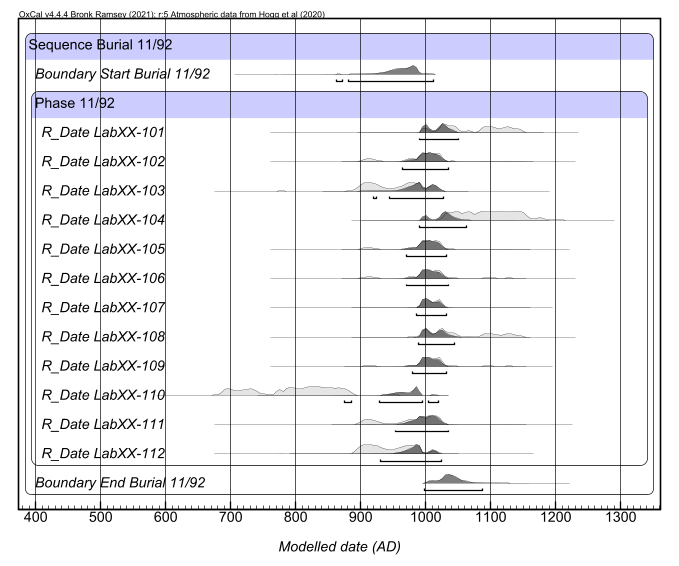
```

...and an $A_{model}$ of \~57, below the notional threshold of 60 that indicates consistency between model parameters and input data (this will produce an `r colorize("angry red", "red")` warning).

What causes this low $A_{model}$? What does it mean that our model parameters are inconsistent with our data? The plot - and the 'A' value that can be found in the 'Table' view - indicate that one date (`r bur_sim_1192[which(bur_sim_1192$c14age == max(bur_sim_1192$c14age)),]$LabID`) is inconsistent with the others. However, our model structure - the bounded phase - is in effect an assertion that these dates should constitute the kind of sample that we would be likely to draw from a coherent distribution. It is very unlikely that sampling a coherent distribution would result in an assemblage in which most of the dates are similar, but one is dramatically different; this improbability results in the low 'A' index.

#### Chronometric hygiene

OxCal's warning is a feature, not a bug: it is telling us that we would be making a mistake if we were to consider all 12 of the radiocarbon dates from Burial 11/92 to be providing equally useful information about our question (keeping in mind that what we want to know is the date of interment). Identifying one or more samples as inconsistent with the others reminds us that we should be considering the samples themselves closely. We should assess the dates on the samples, weighing how well we think that the *dated event* matches the *target event* - and in cases where we suspect a mismatch, *we should not simply continue to treat that radiocarbon date as providing reliable age information about the event in question*. In this case, we know the target event - the moment of interment - and can consider the dated materials (and their context) to make judgments about the dated event for each sample. This screening process is often termed "chronometric hygiene" [@spriggs1989].

Chronometric hygiene is an issue particularly for *legacy dates* - that is, radiocarbon dates published over the last \~75 years, which may often provide age estimates for contexts of great interest, but which may have been produced using varying laboratory procedures and often have less associated information than we might like.

#### Misfits, offsets, and outliers

In cases where we become convinced that a sample is unreliable, we have two options: we can exclude dates from consideration, or we can model an offset. Misfits are dates where the dated event clearly does not match the target event, as determined by other available chronological information (e.g., an Early Holocene date from a context believed to be Late Holocene, or a recent date from a context believed to be \>1000 years old). It is these misfits that chronometric hygiene seeks to identify, so that synthetic chronological assessments (*e.g.*, chronologies of archaeological sites or regions) can be made on the basis of accurate age estimates. Caution has to be exercised in identifying misfits, so that we do not simply reproduce our expectations. For example, it might be reasonable to consider a date from a Lambayeque cemetery (ca. 800 - 1100 CE) a misfit if it were from the middle of the first millennium BCE. However, if that date were from \~700 CE, it *might* be not be a misfit at all, but instead an indication that the use of Lambayeque material culture and burial customs began earlier than previously believed. Misfits mostly commonly result from the incorporation of already old material into archaeological contexts or from the presence of intrusive material in archaeological contexts. They can also result from inaccurate laboratory analyses, but these instances are relatively rare. Samples of material that is older than its context can sometimes provide useful *termini post quem*, but intrusive samples are difficult to work with, and are most simply excluded from analysis, along with inaccurate age estimates. Excluded dates should never simply disappear, however - making research transparent and replicable [@farahani2024; @nicholson2023; @marwick2016] requires that *all* dates should be presented and the exclusion of any that are not incorporated into further analysis should be justified. This has the additional benefit of facilitating subsequent revision of our own work (we might, for instance, exclude a date and later, revising our assumptions, realize that it was in fact not a misfit).

In practice relatively few dates tend to be *obvious* misfits. In cases where the difference between dated event and target event is of a known magnitude (or a magnitude that can be reasonably estimated), we can instead include dates in analysis by modeling that *offset*. Where samples can be identified as incorporating, *e.g.*, old wood or residence time effects, those effects can be accounted for (as priors) in a model.

The identification of samples that are affected by offsets is generally more difficult than the identification of misfits, since offsets are often of a scale small enough that age estimates will not be obviously inaccurate. Their identification is further complicated by the fact that we must also consider *outliers*: since we are producing age estimates based on probabilities, we should expect that some samples will not match our expectations. If we are describing a calibrated radiocarbon age using a 95% HDR, there is a 5% chance - 1 in 20 - that the calendar age of the sample is in fact *outside* of the range we specify. For details of how these cases can be handled in OxCal, see Bronk Ramsey's [-@bronkramsey2009] discussion (confusingly, OxCal uses the same term ("outlier") to refer to outliers, offsets, and misfits).

In our example case, let's suppose that we have C/N results from the human bone samples that rule out the possibility of a marine dietary component (admittedly unlikely, near the coast, but we have enough complications already, without adding that one). With that in mind, let's re-examine Table 5.1 and Figure \@ref(fig:sim-burial1192). For which samples - based on the materials dated - should we *expect* a close match between dated event and the moment of burial? For which should we expect offsets, and of what scale?

'Tools'--\>'Models'--\>'Outlier Model', and under 'Prototype', select "Charcoal". This will populate the other fields, and when you click 'Ok', will add a line to your model that describes a Charcoal Outlier Model, which we can then invoke for any particular sample. To do that, select the sample, then 'Insert'--\>'Other'--\>'Outlier', and specify "Charcoal" as the model and "1" as the probability. That will tell the model that we *expect* the sample to be older than the target event. We're not sure by how much, but The model that we've specified

```{r echo = F, out.extra='style="float:right; padding:10px"', fig.cap = "Adding an Outlier Model."}
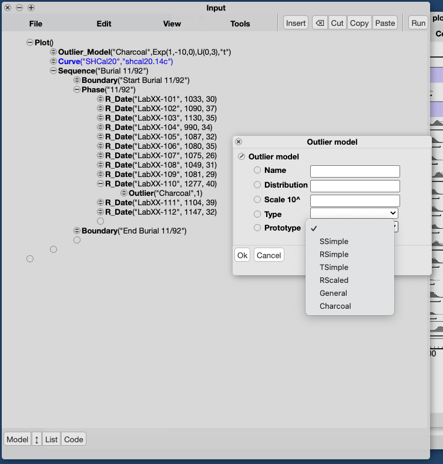
```

You can also of course do this by editing the OxCal code directly, but watch out for `{}` and `;`, which are easy to drop, and without which your code will fail.

Applying a charcoal model to all samples for which it's appropriate and re-running the model will *very* likely produce a model with a higher 'A' index, because we have told the model to *expect* those samples to be too old, and to adjust the posterior estimates accordingly. Since we don't know the exact magnitude of the offset, and since it will vary from one sample to the next, the model will calculate which offsets are both consistent with the outlier model that we've specified and with other parameters, and adjust the probability density function for each date accordingly. If you plot the results and make sure that "Color outliers' is selected under 'Edit'--\>'Format', you should see results something like Figure \@ref(fig:sim1192-outliers), and an 'A' index closer to 120 than to 60.

```{r sim1192-outliers, echo = F, out.extra='style="padding:10px"', fig.cap = "Results of applying an Outlier Model."}
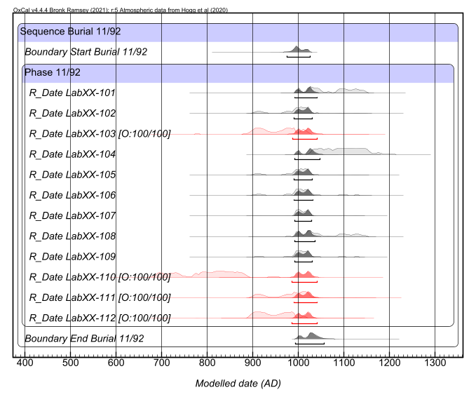
```

Here we have enacted modeling as an iterative process - building a model demonstrated that we needed to apply chronometric hygiene (we had implicitly accepted all of our samples as dating the target event), and applying chronometric hygiene enabled us to rebuild and rerun the model. This process - making our assumptions explicit, examining their implications, and reconsidering our assumptions - is an applicaiton of Bayesian modeling that Bayliss [@bayliss2007, 4] argues is the operationalization of Hodder's [-@hodder1995] hermeneutic spiral.

If we are confident that our samples date the same event, we can use OxCal's 'Combine' function, which calculates what range of time is consistent with all samples, and tests how likely the samples are to be of the same age (i.e., performs a Ward & Wilson test to determine whether the samples are consistent with our assertion that they have the same radiocarbon content). This provides another means of estimating the date of burial, and because the constraints are stronger (the asserted prior is that samples are of the same age, rather than that they come from a coherent distribution), the estimate is likely to be more precise. That precision depends very directly on our prior belief that these samples date the same event, however; it would be a mistake to accept the results unless we are prepared to defend that asserted prior.

To experiment with 'Combine', remove the 'Sequence', 'Phase', and 'Boundary' parameters, and wrap all the samples that you believe to be dating the same event in a 'Combine' command. Your code should look something like this, depending on how many dates you include and which you model as outliers (actual dates will vary because they are randomly generated in the simulation process).

```{js}
 Plot()
 {
  Outlier_Model("Charcoal",Exp(1,-10,0),U(0,3),"t");
  Curve("SHCal20","shcal20.14c");
  Combine("Burial 11/92")
  {
   R_Date("LabXX-101", 1033, 30);
   R_Date("LabXX-102", 1090, 37);
   R_Date("LabXX-103", 1130, 35)
   {
    Outlier("Charcoal",1);
   };
   R_Date("LabXX-104", 990, 34);
   R_Date("LabXX-105", 1087, 32);
   R_Date("LabXX-106", 1080, 35);
   R_Date("LabXX-107", 1075, 26);
   R_Date("LabXX-108", 1049, 31);
   R_Date("LabXX-109", 1081, 29);
   R_Date("LabXX-110", 1277, 40)
   {
    Outlier("Charcoal",1);
   };
   R_Date("LabXX-111", 1104, 39)
   {
    Outlier("Charcoal",1);
   };
   R_Date("LabXX-112", 1147, 32)
   {
    Outlier("Charcoal",1);
   };
  };
 };

```

#### What Bayesian modeling can (and can't) do

The decision about whether 'Combine' is justifiable or not, and for which dates, is representative of Bayesian modeling more generally. Asserting a prior belief that these samples date the same event and should be modeled with 'Combine' is an *argument*. Similarly, there is no magic bullet for identifying and treating outliers, misfits, and offsets. Rather, we have to make *arguments* about which samples are most likely to match age of target event. The fact that we are able to do so is an expression of the underlying logic of Bayesian approaches: we know more about the samples than just their measured radiocarbon ages (for instance, we are likely to know what materials were dated, what context they came from, and how those materials and contexts relate to other materials and contexts), and and we incorporate that knowledge into our age estimates. Bayesian modeling is basically a tool for formalizing that process.

The potential of Bayesian modeling to produce more precise age estimates from radiocarbon dates (and other chronological data) has rightly been a source of excitement in archaeology. Applications of Bayesian modeling of archaeological radiocarbon data have made it possible to describe time in the past with higher resolution, enabling interpretation of the human past that more closely approximates human experience [@whittle2007], as well as to more robustly link archaeological events to paleoclimate data [@manning2020]. These are not just practical advances, but have theoretical implications for the kinds of interpretations that we can make about the human past [@bayliss2018a; @griffiths2023; @griffiths2017].

A more immediate advantage is that Bayesian modeling forces us to explicitly articulate our assumptions. It also highlights the importance of clear questions, clearly and thoroughly understood samples, and explicit articulation/consideration/justification of prior beliefs. The latter emphasizes a conceptual key to interpretation of model results: model consistency (measured with OxCal's agreement ['A'] index) is most useful as a tool for confronting prior beliefs with data, and/or for exploring how consistent data are. Model consistency can also be a useful indicator of inconsistencies between priors, but consistencies among priors cannot indicate anything beyond coherence.

# Working with $^{14}C$ data in R

## Getting data out of OxCal


# Exercise 1

To generate a basis for discussion for our second session, please explore this set (Table 6.1, and available in ['BurialSim2_sim.csv'](https://dcontre.github.io/radiocarbon_workshop/data/BurialSim2_sim.csv)) of radiocarbon ages on 20 samples from 10 burials (thinking about the same cemetery that we explored above). Estimate the span of use of the cemetery. Assume a terrestrial diet for all individuals. Drop dates that you don't trust - but justify excluding them. 

In short: apply chronometric hygiene, build a bounded phase model (or other model, if you think something else is more appropriate!), and account for offsets as you deem necessary. Then generate plot a KDE (and/or other pdfs, as you prefer), and estimate a span. Be prepared to justify your choices, but keep in mind that for our purposes right answers don't really matter - this exercise is intended to be exploratory.


```{r echo = F, warning = F, message = F}
set.seed(42)
bur20_sim2 <- bur20_sim %>% mutate(material = c("gourd", rep("textile", 2), rep("wood", 3), 
                                  rep("human bone", 5), rep("camelid bone", 2), rep("cane", 2), rep("charcoal", 5)),
                     burial = c("11/92", "11/92", "12/92", "13/92", "14/92", "14/92", "11/92", "11/92", "15/92", 
                                "15/92", "16/92", "16/92", "17/92", "15/92", "18/92", "13/92", "19/92", "17/92", "14/92", 
                                "20/92"),
                     ID = paste("LabXX", sprintf('%0.2d', 21:40), sep = "-")) %>% 
  select(-c(c14age:calBP))


#generate cal date of deposition for each burial
bur_ages <- bur20_sim2 %>% arrange(burial) %>% group_by(burial) %>% summarize(n = n()) %>% 
  mutate(calBP_dep = round(runif(10, min = 800, max = 1100), 0))

bur20_sim2 <- bur20_sim2 %>% left_join(bur_ages %>% select(-n))

#calculate offsets
# round(rnorm(100, mean = 1, sd = 3), 0) %>% pmax(0) %>% hist()
# 
# round(rgamma(100, shape = 2, rate = .75), 0) * round(runif(1, min = 0, max = 100), 0) * -1 %>% hist()

mat_counts <- bur20_sim2 %>% group_by(material) %>% count()
wood_off <- round(rgamma(mat_counts %>% filter(material == "wood") %>% pull(n), shape = 2, rate = .75), 0) * 
  round(runif(mat_counts %>% filter(material == "wood") %>% pull(n), min = 0, max = 100), 0) * -1
humbone_off <- round(rnorm(mat_counts %>% filter(material == "human bone") %>% pull(n), mean = 1, sd = 3), 0) %>% pmax(0) * -1
cambone_off <- round(rnorm(mat_counts %>% filter(material == "camelid bone") %>% pull(n), mean = 1, sd = 3), 0) %>% pmax(0) * -1
charc_off <- round(rgamma(mat_counts %>% filter(material == "charcoal") %>% pull(n), shape = 2, rate = .75), 0) * 
  round(runif(mat_counts %>% filter(material == "charcoal") %>% pull(n), min = 0, max = 100), 0) * -1
offsets <- bind_rows(lapply(list(wood_off, humbone_off, cambone_off, charc_off), as.data.frame), .id = "material") %>% 
  rename(`offset` = `X[[i]]`) %>% 
  mutate(material = case_when(
    material == "1" ~ "wood",
    material == "2" ~ "human bone",
    material == "3" ~ "camelid bone",
    material == "4" ~ "charcoal",
  )) 

offsets <- mat_counts %>% filter(!material %in% offsets$material) %>% uncount(n) %>% 
  mutate(offset = 0) %>% 
  bind_rows(offsets)

bur20_sim2 <- bind_cols(arrange(bur20_sim2, material), arrange(offsets, material)) %>% select(-`material...5`) %>% 
  rename(material = `material...2`, LabID = ID) %>% arrange(burial)
  
  
#add dietary offsets


#simulate 14C dates 

bur20_oxsim2 <- oxcalSimulate_cc(bur20_sim2$calBP_dep + bur20_sim2$offset, std = round(rnorm(20, mean = 30, sd = 5), 0), 
                           names = bur20_sim2$LabID, cc = "SHCal20")
ages <- bind_rows(lapply(bur20_oxsim2, '[[', 3)) %>% 
  pivot_longer(names_to = "ID", cols = everything(), values_to = "c14age") %>% 
  filter(is.na(c14age) == F)

errors <- bind_rows(lapply(bur20_oxsim2, '[[', 4)) %>% 
  pivot_longer(names_to = "ID", cols = everything(), values_to = "c14std") %>% 
  filter(is.na(c14std) == F)

bur20_sim2_c14 <- ages %>% left_join(errors) %>% mutate(calBP = bur20_sim2$calBP_dep)

bur20_sim2 <- bur20_sim2 %>% left_join(bur20_sim2_c14 %>% select(-calBP), by = join_by(LabID == ID))

# or maybe generate simulated date using rnorm(), then calibrating, and then rice::r.calib()


#1 gourd, 2 textile fragment, 3 wood, 5 human bone, 2 camelid bone, 2 caña brava, 5 unid wood charcoal
# from 10 different burials, some well-dated, others not
# regenerate calendar ages by group
#some samples should be discarded (but keep and justify - importance of transparency)
# diet info for some human bone samples but not others

#generate table 
bur20_sim2 %>% select(-c(calBP_dep, offset)) %>% kbl(caption = "Radiocarbon dates from Burial 11/92") %>% 
    kable_classic(full_width = F, html_font = "Cambria")

#and csv

#to make csv
bur20_sim2 %>% select(-c(calBP_dep, offset)) %>% write.csv("data/BurialSim2_sim.csv", row.names = F)

#to import into OxCal

bur20_sim2_cql <- bur20_sim2 %>% group_by(burial) %>% 
  summarise(cql = cql_phase(burial, cql_r_date(LabID, c14age, c14std))) %>% 
  summarise(cql = cql(cql("Curve(\"SHCal20\",\"shcal20.14c\");"), 
                      cql_sequence("Burial 11/92", cql, boundaries = TRUE))) %>%
  pluck("cql") %>%
  cql() 
```


# Exercise 2

apply: chronometric hygiene, phase model, boundary selection, offsets, marine reservoir correction generate: KDE, span

assume a local marine dR provide estimates of marine dietary % add sequences, marine reservoir correction, maybe some sample selection?

assuming both uniform and normal distributions?

as above, but normal distribution (i.e. sigma boundary?)? And various types of samples? Then more complicated modeling in Exercise 2?


# Exercise 3 


### A fictional long barrow dated with antlers

Bayliss and colleagues ([@bayliss2007, 7-15](https://doi.org/10.1017/S0959774307000145)) use a set of 28 simulated radiocarbon dates from specified calendar ages, representing a “known” history of construction and use for a fictionalized long barrow (based, Bayliss and colleagues note, “on a simplified version of the chronological model for Hazleton North long cairn presented in [@Meadows_Barclay_Bayliss_2007](https://doi.org/10.1017/S0959774307000169)”). These are presented in here (Table 1) and in the accompanying .xlsx file ([Bayliss_2007_Table1.xlsx](data/Bayliss_2007_Table1.xlsx); below we will revisit some of the modeling that Bayliss and colleagues use to demonstrate the challenges of reconstructing this known long barrow history. That known history is as follows: “The actual dates of the antlers used in the construction of the cairn range from 3695 bc to 3691 bc, the construction of the cairn was completed in 3690 bc, the passage to the north chamber collapsed between 3645 bc and 3640 bc, and the last interment occurred in 3630 bc. Burial occurred continuously for 60 years, between 3690 bc and 3630 bc and all the dated events cover only 65 years.” ([@bayliss2007, 7](https://doi.org/10.1017/S0959774307000145))

Table 1: Simulated radiocarbon dates from [@bayliss2007](https://doi.org/10.1017/S0959774307000145).

|  |  |  |  |  |
|:-------------:|---------------|---------------|---------------|---------------|
|  \*\*\*\* | **Sample ID** | **Calendar age** | **Simulated** <sup>14</sup>C age | **Simulated** <sup>14</sup>C error |
| North entrance | A | 3630 | 4759 | 39 |
|  | B | 3635 | 4840 | 70 |
|  | C | 3640 | 4904 | 38 |
| North chamber | D | 3690 | 4952 | 80 |
|  | E | 3680 | 4933 | 50 |
|  | F | 3670 | 4919 | 70 |
|  | G | 3650 | 4897 | 50 |
|  | H | 3660 | 4862 | 31 |
|  | I | 3675 | 4910 | 33 |
| South chambered area | J | 3690 | 4856 | 32 |
|  | K | 3680 | 4859 | 50 |
|  | L | 3675 | 4941 | 60 |
|  | M | 3670 | 4863 | 26 |
|  | N | 3660 | 4834 | 80 |
|  | O | 3650 | 4898 | 43 |
|  | P | 3645 | 4969 | 60 |
|  | Q | 3640 | 4811 | 70 |
|  | R | 3630 | 4823 | 31 |
|  | S | 3685 | 5093 | 70 |
|  | T | 3635 | 4846 | 80 |
| Antlers | U | 3691 | 4832 | 60 |
|  | V | 3692 | 5049 | 60 |
|  | W | 3695 | 4931 | 50 |
|  | X | 3692 | 4907 | 50 |
| Feasting | Y | 3690 | 4881 | 70 |
|  | Z | 3670 | 4871 | 70 |
|  | AA | 3650 | 4904 | 70 |
|  | BB | 3630 | 4714 | 70 |

 

 

Working with simulated data – in this example and in general – provides an advantage that is crucial in assessing modeling approaches: we are trying to reconstruct a *known* pattern. In this case, the key parameters of the “archaeological” scenario that we are trying to reconstruct are that:

·      the span of time during which burials were placed in the long barrow is 60 years,

·      burial was continuous during that period (rather than concentrated in the early or late part of the period, or with a gap in use at some point),

·      construction was completed in 3690 BCE, and

·      the passage collapsed while the chamber was still in use, between 3645-3640 BCE.

 

By design, these closely mirror common archaeological questions: when was a structure built? when did it fall out of use? was it used continuously? when did archaeological identifiable events (e.g., partial collapse) occur?

The first and most vital point that Bayliss and colleagues make is that visual inspection of these radiocarbon dates after calibration will almost inevitably mislead us. We can explore this for ourselves by importing (see 2.1.2) the dates into a new model in OxCal. By varying the ways in which we model those dates – that is, the amount of prior information we include – we can explore the effect of adding priors on our interpretation of radiocarbon dates, as well as the likely consequences of *not* considering prior information.

Begin by using the Import tool (‘Tools’ ‘Import’) to import the dates from the spreadsheet as radiocarbon determinations, using `R_Date`. Calibrate these (‘File’ ‘Run’) and plot the results (‘View’ ’Plot Dates’) (Figure 1). The results are straightforward: 28 calibrated radiocarbon dates (Figure 2). Consider how you or your colleagues might be likely to interpret these dates, if you were asked to assess when use of the long barrow began, how long it lasted, and when it ended. Likely assessments might be 4000 – 3400 BCE (treating most parts of most probability distributions as indicating relevant activity) or perhaps 3900 – 3500 BCE (presuming that dates that extend outside of the central tendency of the assemblage to be irrelevant). Your assessment might vary in detail from either of these, but is unlikely to be radically different. But *we know* – because the dates are simulated based on known calendar dates – that the barrow was constructed in 3690 BCE and used for 60 years, until 3630 BCE.

```{r echo = F, out.extra='style="float:right; padding:10px"'}
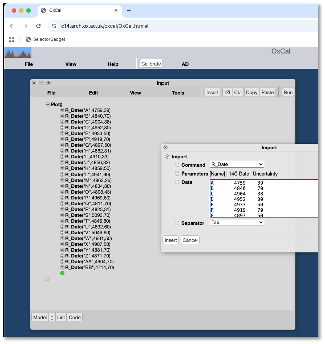
```


By wrapping all of these `R_Date` lines in a `KDE_Plot` command, we can summarize these dates with a kernel density estimate (KDE) ([@bronkramsey2017](https://doi.org/10.1017/RDC.2017.108)), producing a single plot (top of Figure \@ref(fig:ummodeled-plot)).

```{js}
 Plot()
 {
  KDE_Plot(“Name”)
  {
   R_Date("A",4759,39);
   R_Date("B",4840,70);
   …
   R_Date("BB",4714,70);
    };
   };
```

```{r unmodeled-plot, echo = F, out.extra='style="float:right; padding:10px"', fig.cap="Unmodeled dates."}
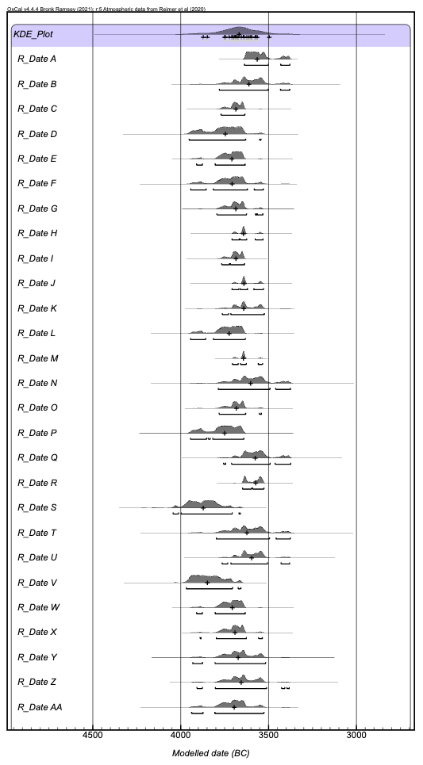
```

This is analogous to a histogram that illustrates frequency (how many dates are associated with a given year?). We can’t make a simple histogram because each radiocarbon determination has uncertainty associated with it that needs to be taken into account. We can look at the plot of that KDE and tell that the medians of most of the dates (the black ‘+’ symbols beneath the plot) fall between approximately 3750 BCE and 3550 BCE. Unfortunately (see below) those medians are not reliable indicators of the actual calendar dates of the dated events, but they do provide us with an alternate means of assessing the likely beginning/end/span of the barrow. [**add a figure of KDE + rug plot of actual calendar dates**]


Perhaps we can improve things by considering – and visualizing – the varied proveniences of the samples. We can classify them (as the table does) by context, associating some with construction, others with use, and visualize this classification by assigning colors to dates in the ‘Code’ view (Figure \@ref(fig:coloring-code)) (you can also manipulate color by using the ‘Edit’ column in the ‘Results’ window or by selecting the ‘Color Selected’ command from the ‘Edit’ dropdown in the ‘Results’ window). 

```{r coloring-code, echo = F, out.extra='style="float:right; padding:10px"'}
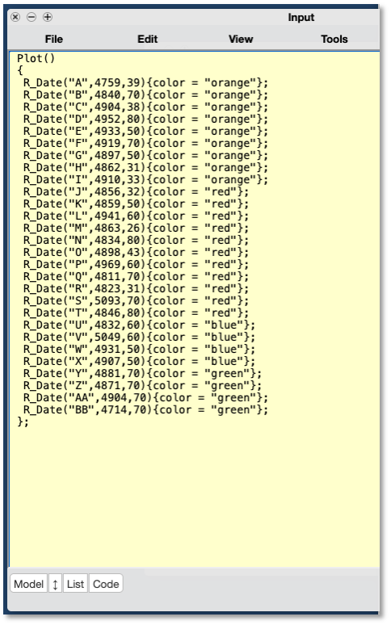
```

The results (Figure \@ref(fig:colored-dates)) begin, in a small way, to allow us to incorporate prior information into our interpretation: although we are not adjusting any probabilities accordingly, they allow us to consider that the dates are associated with archaeologically recognized events (“construction”, “use”, etc), rather than simply all indicative of “the long barrow”. The dates on antlers (in green), for example, are associated with construction, and the dates associated with feasting evidence (in blue) with pre-construction activity. We would *expect*, therefore, that the latter should predate the former – an expectation apparently confounded by the calibrated dates, which do not show any evident precedence of one group relative to the other. Here it becomes critical to consider how each calibrated date (probability density function [pdf]) should be read. These are representing the imprecision with which we can identify the calendar year of the event that we have dated, *not* spans of time. That is, ‘R-Date A’, for example, comes from a sample that we are 95% confident was produced between 3638 and 3380 BCE. Because the probabilities are not evenly distributed (a result of the wiggles in the calibration curve; see Blaauw’s animation illustrating how a date is calibrated), the median of that distribution is 3566 BCE, but as a glance at the plot of the distribution demonstrates, probability is not evenly distributed around that median.  

```{r colored-dates, echo = F, fig.cap = "Classifying and coloring dates."}
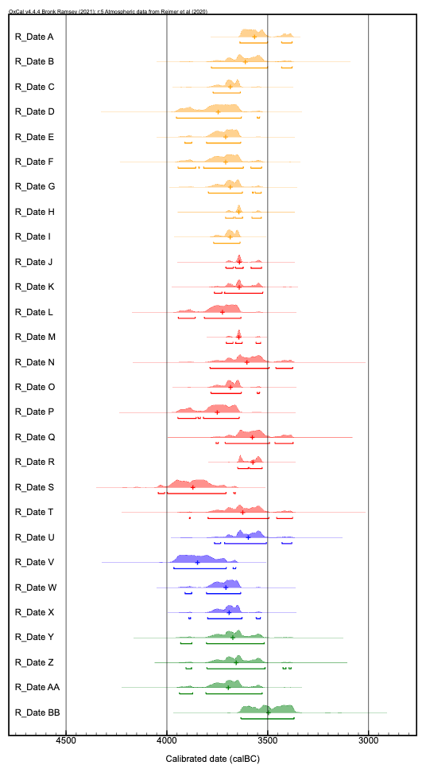
```

This uncertainty leaves plenty of room for the problem we have observed with respect to the antler and feasting dates: events might be in sequence *and we might not be able to tell*. Here the basic insight of a Bayesian approach comes into play: if we’re confident about the sequence of those dated events, because of information derived from their excavation, then we can incorporate that information into our consideration of the radiocarbon results. In fact, we would be foolish not to – why pretend that all things are equally possible when we have good reason to think that they’re not? That is, if we think that the antlers should predate the feasting residue, then we can and should incorporate that information into our assessment of the pdf associated with each date.


The basic building blocks of such a model in OxCal are `Sequence` and `Phase.` `Sequence` specifies the simplest OxCal relationship; elements within a sequence are in chronological order from earliest to latest. `Phase` is effectively the opposite: it specifies that we cannot assert anything about the ordering of the elements contained (but might want, for example, to specify that they all predate or postdate some other model element).

We can illustrate this with a subset of the simulated long barrow data. As noted above, the excavation of the long barrow made clear that feasting events preceded construction, that antler picks were used in construction, and that burial activity followed the conclusion of construction. We can specify this in a model using the `Sequence` and `Phase` commands, which can be nested as necessary. In the code below, we specify an overall sequence (“long barrow”), which begins with a phase (“feasting”). In that “feasting” phase, there are several dated events whose sequence we know nothing about – all we know is that they all precede construction and burial. The “feasting” phase was followed by two subsequent phases: a construction phase (“antlers”) and a burial phase.

[pair code on left with output on right?]

 

```{js}
Plot()
 {
  Sequence("long barrow")
  {
   Phase("feasting")
   {
	R_Date("BB",4714,70);
	R_Date("AA",4904,70);
	R_Date("Z",4871,70);
	R_Date("Y",4881,70);
   };
   Phase("antlers")
   {
	R_Date("X",4907,50);
	R_Date("W",4931,50);
	R_Date("V",5049,60);
	R_Date("U",4832,60);
   };
   Phase("burial activity - south chambered area")
   {
	R_Date("T",4846,80);
	R_Date("S",5093,70);
	R_Date("R",4823,31);
	R_Date("Q",4811,70);
	R_Date("P",4969,60);
	R_Date("O",4898,43);
	R_Date("N",4834,80);
	R_Date("M",4863,26);
	R_Date("L",4941,60);
	R_Date("K",4859,50);
	R_Date("J",4856,32);
   };
  };
 };
 
```

If you run the code, you’ll see that OxCal produces several angry red warnings with the results. There are two issues: poor model agreement (`r colorize("‘Warning! Poor agreement - A= 11.6%(A'c= 60.0%)’", "red")`), and an absence of boundaries (`r colorize("‘Warning! No boundaries used - check manual’", "red")`). The poor agreement is an indicator that you’ve asked the model to believe improbable things: the priors that we’ve specified (three phases in sequence) and the radiocarbon dates that we’ve included in those phases cannot easily be reconciled. We can explore why this is difficult by plotting the model results (Figure \@ref(fig:modeled-sequence)). The absence of boundaries is a warning that we haven’t provided an important prior, which we’ll discuss below.

```{r modeled-sequence, echo = F, fig.cap = "Modeled sequence results."}
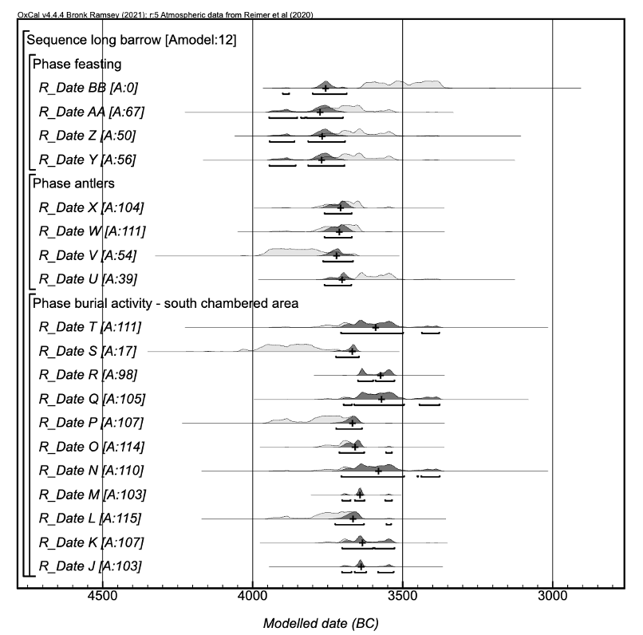
```

The plot of the results differs from our previous efforts (Figure \@ref(fig:unmodeled-plot) and Figure \@ref(fig:colored-dates)) in an important respect: rather than simply displaying a pdf of each calibrated date, the plot shows *two* pdfs for each calibrated date. The calibrated date is in light grey, and the posterior estimate – the probability adjusted using the prior information that we have provided – is in dark grey. For some dates (e.g., *X* and *W*) the difference is subtle but significant: the uncertainty with which we can describe the date is reduced (given what else we know to be true, some ages are more likely than others for each of these dates). For others (e.g., *R* and *Q*) there is no obvious change: the prior information we have provided is not sufficient to reduce this uncertainty (all ages remain possible). For a third category (e.g., *BB* and *S*), the prior and posterior barely overlap: according to our priors, the dated sample is very unlikely to be of the age indicated by the bulk of the calibrated probability. The agreement index for each date reflects these relationships between prior and posterior (for *BB*, for instance, it is 0.3% - that is, for both the date to be accurate and our model priors to be true, we would have to have a radiocarbon date whose actual calendar age is from a part of the distribution that has a \<1% probability).

The low agreement index for the model as a whole (A<sub>model</sub>) is an indication that we have constructed a model that specifies priors and sample ages that are unlikely *all* to be accurate – that is, it’s unlikely (but not impossible) that all of these things can be true. The agreement index for each date tells us which dates are least compatible with the priors and the other dates. This suggests that one of three things is occurring:

1)    The calendar age of a dated sample in fact coincides with a low probability part of the calibrated distribution (including potentially outside of the 95% range that is conventionally plotted).

2)    One or more of our priors is inaccurate. That is, we (or those whose data we are using) have misinterpreted stratigraphic relationships or in some other way asserted some relationship that does not in fact hold.

3)    There is some mismatch, for a date with a low agreement index, between dated event and target event. The model consists of dated events, and if one of the radiocarbon dates that we are using to approximate one of those events (construction of a wooden shelter, for example) in fact dates some other event (the deposition of a growth ring 100 years before a tree was felled and used in construction, perhaps), then the radiocarbon date will be a poor fit for the chronological position specified in the model.

Identifying which of these possibilities we think is most likely and adjusting the model accordingly is the focus of most chronological modeling (for discussion with two worked examples, see [@Manning_2015](https://www.taylorfrancis.com/chapters/edit/10.4324/9781315739274-17)).

Before pursuing those complexities, however, we should consider the second warning (`r colorize("‘Warning! No boundaries used - check manual’", "red")`). This is an indication that we have left out a prior that is fundamental to OxCal logic: a pair of boundaries.

`Boundary` is a crucial OxCal command that does much more than it appears to do; boundaries (detailed in Bronk Ramsey 2009) do not simply delimit sets of dates, but are an assertion that the dated events that they bracket constitute a sample from some hypothetical population.  

Boundaries, which work in pairs and often around a phase, assert that the events between them are sampled from a coherent distribution. This too constitutes prior information, and has an important implication: *if the dated events that we have constitute a sample from a population whose distribution we can infer, then some sample distributions are more likely than others*. For example, if the dated events that we have come from a population of dateable events that is normally distributed, then the dated events that we have – sampled from that population – are much more likely to fall towards the center of that distribution than towards the edges. This has the important practical implication that some distributions of samples are more likely than others, and can allow us to prefer some parts of the pdf associated with each calibrated radiocarbon date to others.

The effect of adding boundaries is almost always to constrain the spread of a group of dates, even when the distribution that we posit is a uniform one (an “uninformative prior”, which is to say that it should have minimal effect). We can also construct a complete model, using the structure provided by Bayliss and colleagues ([@bayliss2007, Fig. 7](https://doi.org/10.1017/S0959774307000145)); code below. Here we add the `Boundary` command to the `Sequence` and `Phase` commands used above. You’ll also see the commands `R_Date`, which you already have met above, and `Date`, which here is functioning as a query – that is, if there were an event at this point in the model, when would it fall (given that it has to come after some events and before others).

[pair code on left with output on right]

```{js}
Plot()
 {
  Sequence("long barrow")
  {
   Boundary("start of cairn phase");
   Phase("cairn phase")
   {
	Phase("feasting")
	{
 	R_Date("BB",4714,70);
 	R_Date("AA",4904,70);
 	R_Date("Z",4871,70);
 	R_Date("Y",4881,70);
	};
	Sequence("construction/burial")
	{
 	Phase("antlers")
 	{
  	R_Date("X",4907,50);
  	R_Date("W",4931,50);
  	R_Date("V",5049,60);
  	R_Date("U",4832,60);
 	};
 	Date("construction finished");
 	Phase("burial activity")
 	{
  	Phase("south chambered area")
  	{
   	R_Date("T",4846,80);
   	R_Date("S",5093,70);
   	R_Date("R",4823,31);
   	R_Date("Q",4811,70);
   	R_Date("P",4969,60);
   	R_Date("O",4898,43);
   	R_Date("N",4834,80);
   	R_Date("M",4863,26);
   	R_Date("L",4941,60);
   	R_Date("K",4859,50);
   	R_Date("J",4856,32);
  	};
  	Sequence("north chambered area")
  	{
   	Phase("north chamber")
   	{
    	R_Date("I",4910,33);
    	R_Date("H",4862,31);
    	R_Date("G",4897,50);
    	R_Date("F",4919,70);
    	R_Date("E",4933,50);
    	R_Date("D",4952,80);
   	};
   	Date("passage collapse");
   	Phase("north entrance")
   	{
    	Sequence("articulated skeletons")
    	{
     	R_Date("C",4904,38);
     	R_Date("B",4840,70);
     	R_Date("A",4759,39);
    	};
   	};
  	};
 	};
	};
   };
   Boundary("end of cairn phase");
  };
 };
```

 

The combined impact of adding boundaries and building in more constraints is dramatic \@ref(fig:complete-model).

```{r complete-model, echo = F, fig.cap = "Results of complete model."}
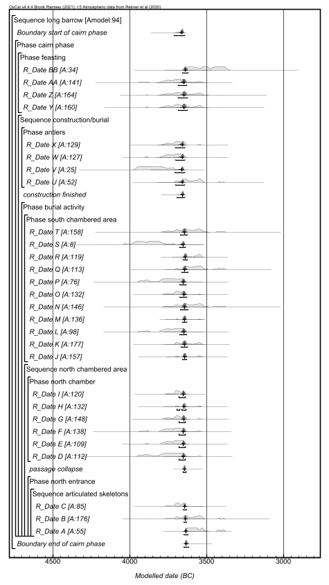
```


 [Export posteriors from OxCal import into R create composite figure that includes calendar dates + estimates]

 

Rebuild also examples from [@Manning_2015](https://www.taylorfrancis.com/chapters/edit/10.4324/9781315739274-17), or at least the first one, which uses dates and data from [@renfrew2012oldest](https://doi.org/10.1017/S0003598X00062517) to illustrate identifying and dealing with issues of inbuilt age and the effects of varying priors?

 

# References
